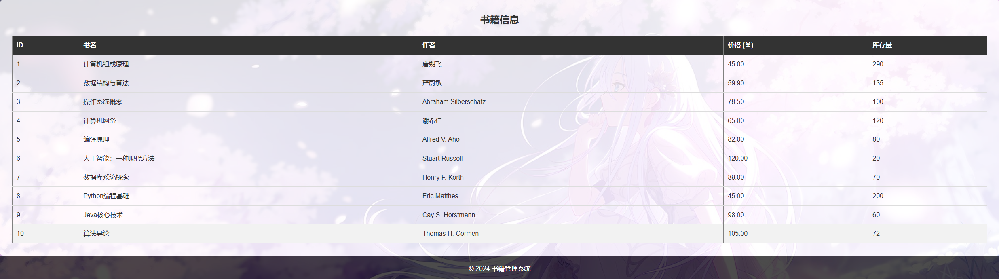

# 《数据库系统》课程设计报告

|     题目     | 图书销售管理系统 |                  |      |
| :----------: | :--------------: | :--------------: | :--: |
| 小组成员信息 |                  |                  |      |
|     姓名     |       学号       |       班级       | 分工 |
|    胡舸耀    |     22336084     | 计算机科学与技术 | 全部 |

提交时间：2024年12月28日

## 一、 开发环境与开发工具

**开发环境：**

1、Windows 11；

2、Web框架 ：使用Flask （Python 3.12.4）作为后端框架；

3、数据库：MYSQL 8.0；

4、前端技术 ：HTML、CSS、JavaScript；

**开发工具：**

1、IDE：Visual Studio Code；

2、数据库管理工具：MySQL Workbench 8.0 CE；

## 二、系统需求分析

### **系统数据字典**

结合我们需要的功能，我们要实现进货、购买、退货、统计，每个关系各自生成一个表记录

**数据字典：**

| 字段名/表名          | 数据类型       | 描述       | 约束                             |
| -------------------- | -------------- | ---------- | -------------------------------- |
| **Books**      |                |            |                                  |
| book_id              | INT            | 书籍ID     | 主键，自动增量                   |
| title                | VARCHAR(255)   | 书名       | 非空                             |
| author               | VARCHAR(255)   | 作者       | 非空                             |
| price                | DECIMAL(10, 2) | 价格       | 非空                             |
| stock                | INT            | 库存量     | 默认值：0                        |
| **Suppliers**  |                |            |                                  |
| supplier_id          | INT            | 供应商ID   | 主键，自动增量                   |
| book_id              | INT            | 书籍ID     | 外键，参照Books(book_id)         |
| price                | DECIMAL(10, 2) | 单本价格   | 非空                             |
| number               | INT            | 书籍数量   | 大于等于0                        |
| name                 | VARCHAR(255)   | 供应商名称 | 非空                             |
| contact_info         | VARCHAR(255)   | 联系方式   |                                  |
| supply_date          | DATE           | 进货日期   | 非空                             |
| **Customers**  |                |            |                                  |
| customer_id          | INT            | 顾客ID     | 主键，自动增量                   |
| name                 | VARCHAR(255)   | 顾客姓名   | 非空                             |
| phone                | VARCHAR(20)    | 顾客电话   |                                  |
| email                | VARCHAR(255)   | 顾客邮箱   |                                  |
| **Sales**      |                |            |                                  |
| sale_id              | INT            | 销售ID     | 主键，自动增量                   |
| book_id              | INT            | 书籍ID     | 外键，参照Books(book_id)         |
| quantity             | INT            | 销售数量   | 非空                             |
| sale_price           | DECIMAL(10, 2) | 销售价格   | 非空                             |
| sale_date            | DATE           | 销售日期   | 非空                             |
| customer_id          | INT            | 顾客ID     | 外键，参照Customers(customer_id) |
| **Returns**    |                |            |                                  |
| return_id            | INT            | 退货ID     | 主键，自动增量                   |
| book_id              | INT            | 书籍ID     | 外键，参照Books(book_id)         |
| quantity             | INT            | 退货数量   | 非空                             |
| return_date          | DATE           | 退货日期   | 非空                             |
| customer_id          | INT            | 顾客ID     | 外键，参照Customers(customer_id) |
| **Statistics** |                |            |                                  |
| statistic_id         | INT            | 统计ID     | 主键，自动增量                   |
| month                | DATE           | 统计月份   | 非空                             |
| total_sales          | DECIMAL(10, 2) | 销售总额   | 非空                             |
| total_quantity       | INT            | 销售总量   | 非空                             |
| top_selling_books    | TEXT           | 畅销书排行 |                                  |

## 三、功能需求分析

系统的主要功能需求包括：

1. **进货管理**
   * **功能** ：记录新进货书籍的相关信息（如数量、供应商、进货价格等），更新库存。
   * **输入** ：书籍ID、进货数量、进货价格、供应商ID。
   * **输出** ：进货单，库存更新，进货记录。
2. **销售管理**
   * **功能** ：记录顾客购买书籍的相关信息，更新库存。
   * **输入** ：书籍ID、销售数量、顾客信息。
   * **输出** ：销售单，库存更新，销售记录。
3. **退货管理**
   * **功能** ：记录顾客退还书籍的相关信息，更新库存。
   * **输入** ：书籍ID、退货数量、顾客信息。
   * **输出** ：退货单，库存更新，退货记录。
4. **统计功能**
   * **功能** ：生成月度/年度销售报表，包括销售总额、销售总量、畅销书排行等。
   * **输出** ：销售总额、总量报表，畅销书排行榜。
5. **库存管理**
   * **功能** ：实时更新库存数量，防止库存不足或过多。
   * **输入/输出** ：库存信息实时更新。
6. **查询功能**
   * **功能** ：用户可以查询书籍、进货记录、销售信息、退货信息等。
   * **输入** ：查询条件（如书名、日期范围等）。
   * **输出** ：查询结果。

### 系统功能模块图

系统的功能模块图展示了各功能模块之间的关系和交互。


## 四、系统设计

### 1. 数据概念结构设计（系统ER图）


它描述了系统中的实体、属性以及实体之间的关系。系统包括以下主要实体：

* **Books** （书籍）
* **Suppliers** （供应商）
* **Customers**（顾客）
* **Sales** （销售信息）
* **Returns** （退货信息）
* **Statistics** （统计信息）

实体之间的关系：

* **Books** 和  **Suppliers** ：一对多关系（多个供应商可以提供一种书籍）（如果想要进一步拓展供应商方面，可以创建purchase表做为购买关系，单独记录购买信息，但因为单人工作原因，减少工作量，这里选择和suppliers表合并）
* **Books** 和 **Customers** ：多对一关系（一个顾客可以多次购买退货）

### 2. 数据库关系模式设计

如前所述，我们已经设计了相关的数据库表结构。这些表的关系通过外键关联，并确保数据的一致性和完整性。下面是数据库表的设计概述：

* **Books** 表：存储书籍信息，包括书籍ID、书名、作者、价格和库存等；
* **Suppliers** 表：存储供应商信息，存储进货记录，包括进货书籍ID、数量、价格等；
* **Customers**表：存储顾客信息，包括顾客ID、姓名、联系方式；
* **Sales** 表：存储销售记录，包括销售书籍ID、数量、价格、顾客信息等；
* **Returns** 表：存储退货记录，包括退货书籍ID、数量、顾客信息等；
* **Statistics** 表：存储销售统计信息，如总销售额、畅销书排名等。

**Primary Keys** ：

* `book_id` (Books 表)
* `supplier_id` (Suppliers 表)
* `purchase_id` (Purchases 表)
* `sale_id` (Sales 表)
* `return_id` (Returns 表)
* `customer_id` (Customers 表)

**Foreign Keys** ：

* `book_id`（Sales、Returns 、Suppliers表中）
* `customer_id`（Sales、Returns 表中）

### 3. 数据库物理结构设计

表空间管理 ：根据表的大小和访问频率，将数据表划分到不同的表空间中。

索引设计：

* 为 **Books** 表的 `book_id`、**Sales** 表的 `sale_date` 等常用查询字段建立索引。
* 为 **Statistics** 表的 `month` 字段建立索引，以加速按月份的查询。

数据存储 ：

* 使用适当的数据类型来节省存储空间（如使用 `DECIMAL` 存储价格，使用 `INT` 存储库存数量）。
* 对于历史数据（如销售记录、进货记录等），可以使用分区表来提高查询效率。

## 五、系统功能的实现

### 1、MYSQL实现：

根据系统字典，生成数据库以及每个表：

```sql
CREATE DATABASE bookstore CHARACTER SET utf8mb4 COLLATE utf8mb4_unicode_ci;
USE bookstore;

-- 图书表
CREATE TABLE Books (
    book_id INT AUTO_INCREMENT PRIMARY KEY,
    title VARCHAR(255) NOT NULL,
    author VARCHAR(255) NOT NULL,
    price DECIMAL(10, 2) NOT NULL,
    stock INT DEFAULT 0
);

-- 供应商表
CREATE TABLE Suppliers (
    supplier_id INT AUTO_INCREMENT PRIMARY KEY,
    book_id INT NOT NULL,
    price DECIMAL(10, 2) NOT NULL,
    number INT NOT NULL CHECK (number >= 0),
    name VARCHAR(255) NOT NULL,
    contact_info VARCHAR(255),
    supply_date DATE NOT NULL,
    FOREIGN KEY (book_id) REFERENCES Books(book_id)
);

-- 顾客表
CREATE TABLE Customers (
    customer_id INT AUTO_INCREMENT PRIMARY KEY,
    name VARCHAR(255) NOT NULL,
    phone VARCHAR(20),
    email VARCHAR(255)
);

-- 销售表
CREATE TABLE Sales (
    sale_id INT AUTO_INCREMENT PRIMARY KEY,
    book_id INT NOT NULL,
    quantity INT NOT NULL,
    sale_price DECIMAL(10, 2) NOT NULL,
    sale_date DATE NOT NULL,
    customer_id INT NOT NULL,
    FOREIGN KEY (book_id) REFERENCES Books(book_id),
    FOREIGN KEY (customer_id) REFERENCES Customers(customer_id)
);

-- 退货表
CREATE TABLE Returns (
    return_id INT AUTO_INCREMENT PRIMARY KEY,
    book_id INT NOT NULL,
    quantity INT NOT NULL,
    return_date DATE NOT NULL,
    customer_id INT NOT NULL,
    FOREIGN KEY (book_id) REFERENCES Books(book_id),
    FOREIGN KEY (customer_id) REFERENCES Customers(customer_id)
);

-- 统计表
CREATE TABLE Statistics (
    statistic_id INT AUTO_INCREMENT PRIMARY KEY,
    month DATE NOT NULL,
    total_sales DECIMAL(10, 2) NOT NULL,
    total_quantity INT NOT NULL,
    top_selling_books TEXT
);
```

为了实现books的自动更新，我们加入触发器，在进货、销售、退货时更新books库存：

```sql
DELIMITER $$

CREATE TRIGGER update_book_stock_after_supply
AFTER INSERT ON Suppliers
FOR EACH ROW
BEGIN
    UPDATE Books 
    SET stock = stock + NEW.number 
    WHERE book_id = NEW.book_id;
END $$

DELIMITER ;
DELIMITER $$

CREATE TRIGGER update_book_stock_after_sale
AFTER INSERT ON Sales
FOR EACH ROW
BEGIN
    UPDATE Books
    SET stock = stock - NEW.quantity
    WHERE book_id = NEW.book_id;
END $$

DELIMITER ;
DELIMITER $$

CREATE TRIGGER update_book_stock_after_return
AFTER INSERT ON Returns
FOR EACH ROW
BEGIN
    UPDATE Books
    SET stock = stock + NEW.quantity
    WHERE book_id = NEW.book_id;
END $$

DELIMITER ;
```

到这里，我们就基本实现了MYSQL部分的代码，可以正常更新存储和更新数据。

### 2、Flask实现

首先实现数据库连接，我选择本地连接，在config.py文件中定义连接信息：

```python
DB_CONFIG = {
    'host': 'localhost',
    'user': 'root',
    'password': 'your_password',
    'database': 'bookstore'
}
```

再在models.py文件中调用：

```python
import mysql.connector
from config import DB_CONFIG

def get_db_connection():
    return mysql.connector.connect(**DB_CONFIG)
```

之后在app使用中，只需要调用 `def get_db_connection():`就可以连接到数据库。

在app.py中，我们实现各个系统功能以及其中一些限制，这里我主要选择销售、退货、统计这三个部分来讲解。

销售部分中，我在一般购买的基础上，加上了选择书籍后自动填充书籍价格的功能，这里我利用AJAX请求，在选择书籍后，访问书籍价格并打印：

```python
@app.route('/get_book_price/<int:book_id>', methods=['GET'])
def get_book_price(book_id):
    conn = get_db_connection()
    cursor = conn.cursor(dictionary=True)
    cursor.execute("SELECT price FROM Books WHERE book_id = %s", (book_id,))
    book = cursor.fetchone()
    cursor.close()
    conn.close()
  
    if book:
        return jsonify({'price': book['price']})
    else:
        return jsonify({'price': None})
```

在退货过程中，我们要确保，在退货前，在之前的时间，同一顾客已经购买了足够多数量的书籍，才能确保退货成功，这部分可以通过触发器或者python实现，这里我选择在flask（python）中实现：

```python
#退货
@app.route('/returns', methods=['GET', 'POST'])
def returns():
    if request.method == 'POST':
        data = request.form
        book_id = data['book_id']
        quantity = int(data['quantity'])
        customer_id = data['customer_id']
        return_date = data['return_date']

        # 连接数据库
        conn = get_db_connection()
        cursor = conn.cursor()

        # 检查该书籍在退货前是否有足够的购买记录
        cursor.execute("""
            SELECT SUM(quantity) 
            FROM Sales 
            WHERE book_id = %s AND sale_date <= %s AND customer_id = %s
        """, (book_id, return_date, customer_id))
      
        total_purchased = cursor.fetchone()[0] or 0

        if total_purchased >= quantity:
            try:
                # 执行退货操作
                cursor.execute("""
                    INSERT INTO Returns (book_id, quantity, return_date, customer_id) 
                    VALUES (%s, %s, %s, %s)
                """, (book_id, quantity, return_date, customer_id))
                conn.commit()
                flash("退货成功！")
            except Exception as e:
                conn.rollback()
                flash(f"退货失败: {e}")
        else:
            flash("退货信息错误，无法退货！")

        cursor.close()
        conn.close()
        return redirect(url_for('returns'))

    return render_template('returns.html')
```

统计部分，我这里实现了单月销售总额、销售总量、畅销书排行。我们要先统计购买和退货记录，通过销售总额减去退货总额得到真实销售总额，后两者同理。并且更新本月的统计信息。

```python
@app.route('/statistics', methods=['GET'])
def statistics():
    conn = get_db_connection()
    cursor = conn.cursor()

    # 获取月份参数
    month = request.args.get('month', None)
    stats = None

    if month:
        # 查询销售总额
        query_sales_total = """
            SELECT SUM(sale_price * quantity) 
            FROM Sales 
            WHERE DATE_FORMAT(sale_date, '%Y-%m') = %s
        """
        cursor.execute(query_sales_total, (month,))
        total_sales = cursor.fetchone()[0] or 0

        # 查询退货总额，连接 Sales 表获取 sale_price
        query_returns_total = """
            SELECT SUM(s.sale_price * r.quantity)
            FROM Returns r
            JOIN Sales s ON r.book_id = s.book_id
            WHERE DATE_FORMAT(r.return_date, '%Y-%m') = %s
        """
        cursor.execute(query_returns_total, (month,))
        returns_total = cursor.fetchone()[0] or 0

        # 计算最终的销售总额（销售 - 退货）
        total_sales -= returns_total

        # 查询销售总量（销售总量 - 退货总量）
        query_sales_quantity = """
            SELECT SUM(quantity) 
            FROM Sales 
            WHERE DATE_FORMAT(sale_date, '%Y-%m') = %s
        """
        cursor.execute(query_sales_quantity, (month,))
        total_quantity = cursor.fetchone()[0] or 0

        # 查询退货总量
        query_returns_quantity = """
            SELECT SUM(quantity) 
            FROM Returns 
            WHERE DATE_FORMAT(return_date, '%Y-%m') = %s
        """
        cursor.execute(query_returns_quantity, (month,))
        returns_quantity = cursor.fetchone()[0] or 0

        # 计算最终的销售总量（销售 - 退货）
        total_quantity -= returns_quantity

        # 查询畅销书排行（按销售数量排序，扣除退货数量）
        query_top_selling_books = """
            SELECT s.book_id, 
                   SUM(s.quantity) - IFNULL(SUM(r.quantity), 0) AS total_quantity
            FROM Sales s
            LEFT JOIN Returns r ON s.book_id = r.book_id AND DATE_FORMAT(r.return_date, '%Y-%m') = %s
            WHERE DATE_FORMAT(s.sale_date, '%Y-%m') = %s
            GROUP BY s.book_id
            ORDER BY total_quantity DESC
            LIMIT 10
        """
        cursor.execute(query_top_selling_books, (month, month))
        top_selling_books = cursor.fetchall()

        # 如果查询结果为空，给 top_books_info 赋一个默认值
        if not top_selling_books:
            top_books_info = "无畅销书"
        else:
            # 格式化畅销书信息
            top_books_info = ", ".join([f"书籍ID: {book[0]} - 销售量: {book[1]}本"
                                        for book in top_selling_books])

        stats = (total_sales, total_quantity, top_books_info)

    conn.close()

    # 如果没有统计结果，给 stats 一个默认值
    if stats is None:
        stats = (0, 0, "无畅销书")

    # 渲染统计结果页面
    return render_template('statistics.html', statistics=stats)
```

### 3、前端实现

前端代码过多，我不一一展示，只讲解实现原理，首先在base界面定义好每个系统功能的URL，以及具体背景，设置整体页面信息。

在index（首页）中，展示书籍信息。

在suppliers（进货）中，选择进货id，书籍id等后，正常更新库存。

在sales（购买）中，实现调用获取书籍价格，选择书籍名称和id后，可以显示出书籍价格。

在returns（退货）中，实现了flash信息显示，退货成功或失败显示出对应消息。

在statistics（统计）中，实现了每个月的信息统计显示。

整体上，为UI界面增添了表格格式以及按钮美化，且为整个背景增加背景图。

### 4、运行结果

#### 4.1、首页

在sql中，加入书籍信息以及顾客信息数据，添加索引。

```sql
INSERT INTO Books (title, author, price, stock) VALUES
('计算机组成原理', '唐朔飞', 45.00, 200),
('数据结构与算法', '严蔚敏', 59.90, 150),
('操作系统概念', 'Abraham Silberschatz', 78.50, 100),
('计算机网络', '谢希仁', 65.00, 120),
('编译原理', 'Alfred V. Aho', 82.00, 80),
('人工智能：一种现代方法', 'Stuart Russell', 120.00, 50),
('数据库系统概念', 'Henry F. Korth', 89.00, 70),
('Python编程基础', 'Eric Matthes', 45.00, 200),
('Java核心技术', 'Cay S. Horstmann', 98.00, 60),
('算法导论', 'Thomas H. Cormen', 105.00, 90);

INSERT INTO Customers (name, phone, email) VALUES
('李明', '13812345678', 'liming@example.com'),
('张伟', '13987654321', 'zhangwei@example.com'),
('王刚', '13711223344', 'wanggang@example.com'),
('刘芳', '13699887766', 'liufang@example.com'),
('陈晨', '13555667788', 'chenchen@example.com');

CREATE INDEX idx_book_id ON Books (book_id);
CREATE INDEX idx_sale_date ON Sales (sale_date);
CREATE INDEX idx_month ON Statistics (month);
```

成功后，我们在python环境中运行app.py函数，打开服务器。在web网页中打开[http://127.0.0.1:5000/](http://127.0.0.1:5000/)。


可以看到，导入的书籍信息正确显示在首页上。

#### 4.2、进货管理

接下来打开进货系统，尝试一次进货：（进货系统实现不够完全，当选择books中未有的书籍时，会自动跳过这次进货操作）


可以看到正确写入信息后，首页的书籍数量确实更改。

#### 4.3、购买管理

打开购买界面，会给出可选择书籍表，选择对应书籍后会自动显示价格。


顾客1购买了20本2号书，可以看到首页书籍数量确实更改。

#### 4.4、退货管理

假如我们选择了购买日期之前退货、未购买的顾客退货、退货数量超过、都会显示退货信息错误，无法退货字样。


这里我选择了1号顾客在29日，退货5本2号书，退货成功。回到首页，可以看到书籍信息正确更改。


#### 4.5、统计管理

添加信息，同个月（12月），1号顾客购买了10本1号书，2号顾客购买了30本6号书，3号顾客购买了18本10号书。



这时选择统计输出12月的销售统计：


可以看到，进货和退货信息都被正常统计，得到了正确结果。到这里，所有功能都正常实现。

#### 4.6、文件解释

数据存放路径如下：

```
/bookstore #根目录
├── app.py                  # 主应用程序文件
├── /templates              # HTML 
│   ├── base.html   
│   ├── index.html  
│   ├── suppliers.html   
│   ├── sales.html  
│   ├── returns.html  
│   └── statistics.html   
├── /static                 # 存放静态文件
│   ├── style.css  
│   ├── script.js           # 可能的客户端脚本
│   └── /images             # 存放图片文件
│       └── 001.jpg         # 背景图片
├── models.py               # 数据库模型
├── config.py               # 配置文件
├── README.md
├── bookstore.sql           # MYSQL备份
└── /image                  # markdown文件图片
```

使用时，将bookstore.sql导入本地MYSQL，在config.py修改自己的配置文件，python运行app.py，在web网站中打开[http://127.0.0.1:5000/](http://127.0.0.1:5000/)即可。

## 六. 总结

在本课程设计中，我们结合了《数据库系统》理论课的核心概念与知识，通过实际应用来深入理解数据库的基本原理与操作。首先，课程设计中涉及的数据库基础概念帮助我们理解了数据库的基本组成，包括数据库、数据库管理系统（DBMS）以及数据模型。在设计数据库时，我们采用了 关系模型 ，通过表来组织数据，表中的每一行代表一个记录，每一列代表一个数据字段，这样的数据结构符合关系数据库的基本要求。

在数据库设计中，我们使用了实体关系模型（ER 模型）来表示数据实体及其之间的关系，帮助我们设计出符合需求的表结构。为了减少数据冗余和提高数据一致性，我们通过规范化技术对表进行设计，确保数据库符合第一范式、第二范式和第三范式。此外，外键（Foreign Key）的使用确保了不同表之间的关联性，维持了数据的完整性和一致性。

在实际操作中，SQL是实现数据库管理和操作的核心工具。我们通过 数据定义语言来创建、修改和删除数据库表结构，使用数据操作语言来执行插入、查询、更新和删除等操作。在查询过程中，特别使用了SQL 查询优化 ，如通过建立索引来加速查询，提高数据库性能。例如，在本课程设计中，我们对常用查询字段（如书籍ID、销售日期等）进行了索引设计，以加速查询过程。

在事务管理方面，理解和应用了 ACID 属性 ，确保数据库在并发操作下的可靠性和一致性。事务保证了操作的原子性 、 一致性 、隔离性和持久性 ，尤其在处理销售和退货等数据时，确保了数据的准确性和完整性。为了提高操作效率，我们还使用了存储过程和触发器 ，通过存储过程将一些复杂操作封装起来，并通过触发器自动更新相关数据，避免了手动操作带来的错误和冗余。

在数据库维护方面，备份与恢复是保证数据安全的重要手段。在本设计中，我们考虑了数据库的备份策略，确保数据能够在发生故障时迅速恢复。此外，通过Web框架Flask与MySQL的集成，我们实现了前端与数据库的交互，完成了数据的动态查询和展示。通过表单提交数据并实时更新数据库，我们实现了包括销售、退货等功能，确保系统的业务逻辑能够正确执行。

总的来说，通过这次实验不仅加深了对数据库系统核心理论知识的理解，还将这些理论知识应用于实际的系统开发中。在设计数据库时，遵循了规范化原则和数据一致性要求，使用SQL进行数据查询和操作，利用事务保证数据的可靠性，同时通过优化设计提升系统性能。通过实践，我更深入地理解了如何在实际业务中合理使用数据库技术，解决现实问题。

当然，这个系统的设计上还有很多缺陷，例如管理系统和用户系统的分离，供应进货系统进一步的完善，可以进货不存在的书籍，增添到books中。查询系统也是非常重要的一个部分，可以通过不同的选择对书籍的各个信息进行查询。还有很多很多，因为个人实现的原因不能全部实现。同时，这些系统功能的实现都离不开数据库系统的知识以及运用，希望在之后的学习和工作可以进一步学习到数据库的知识，并且运用到实际生活当中。
