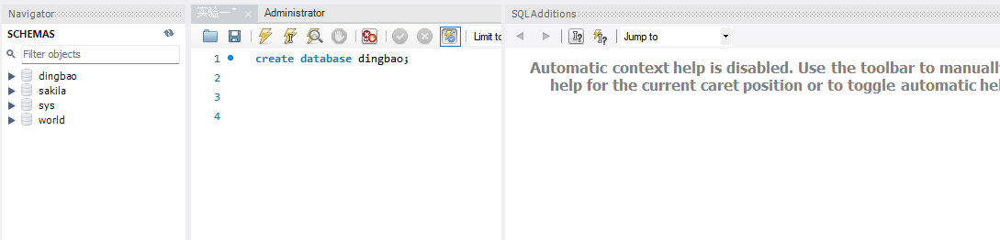
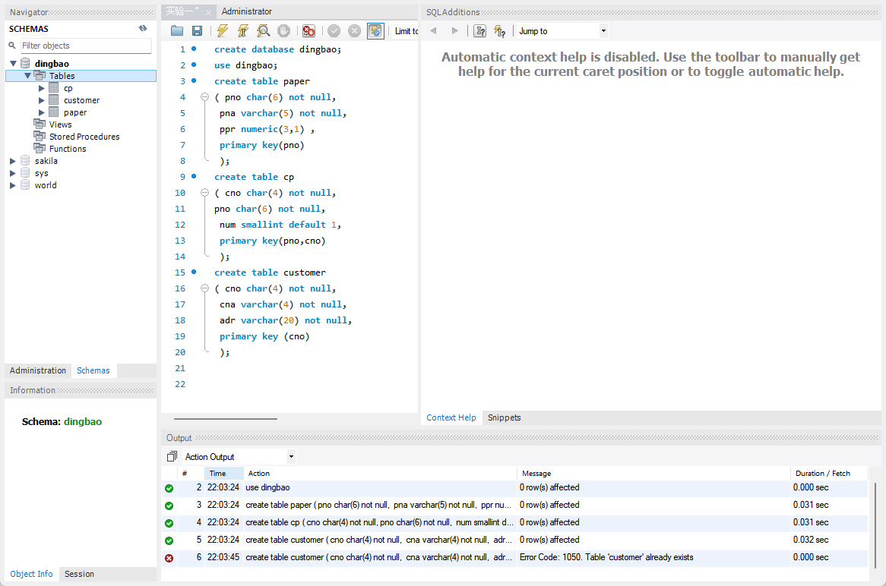
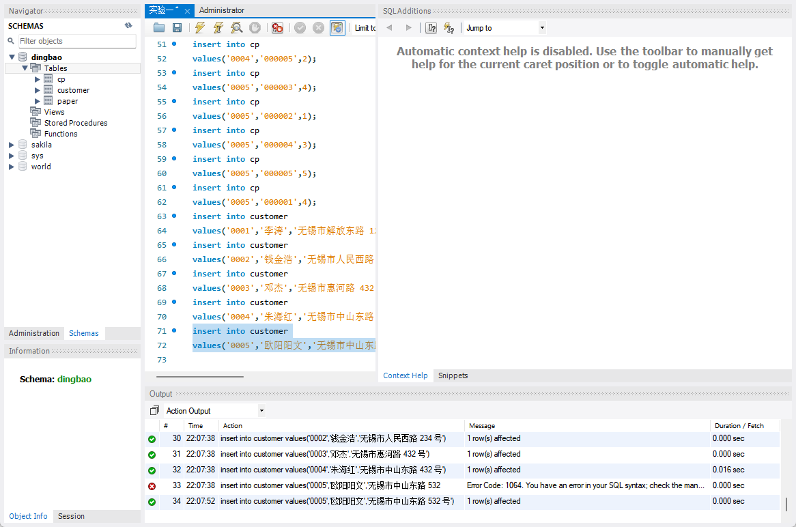
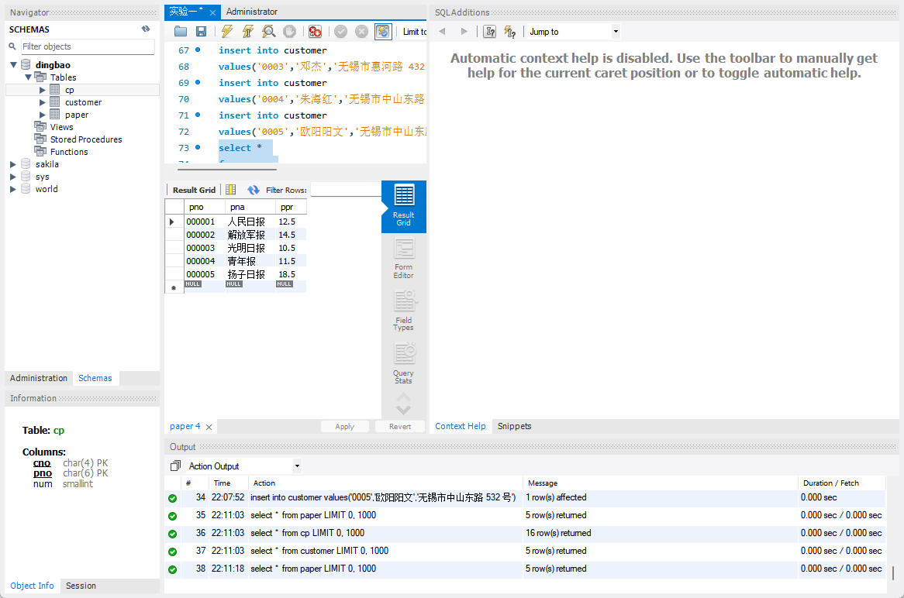
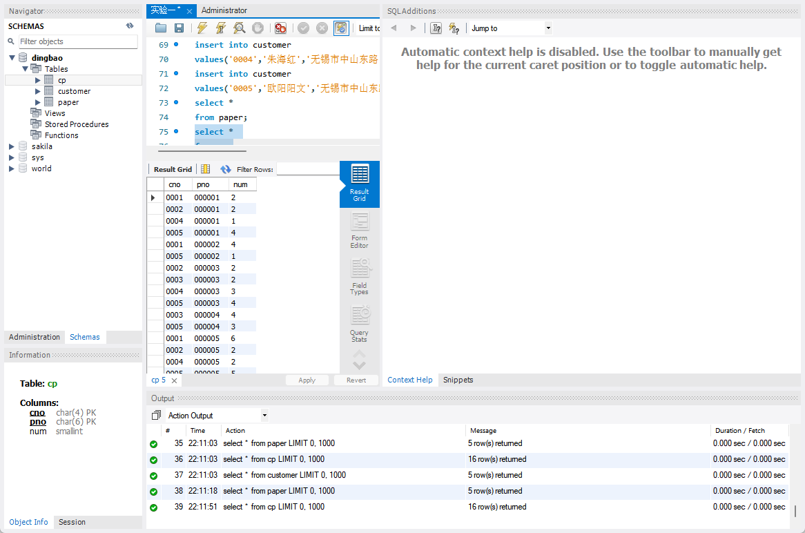
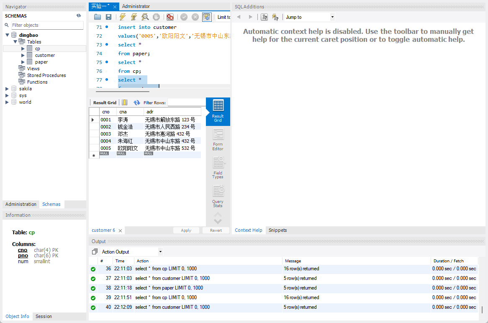
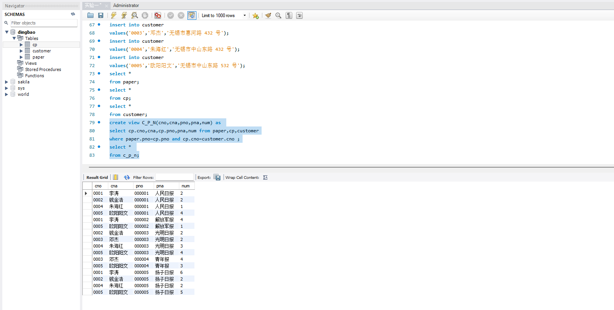
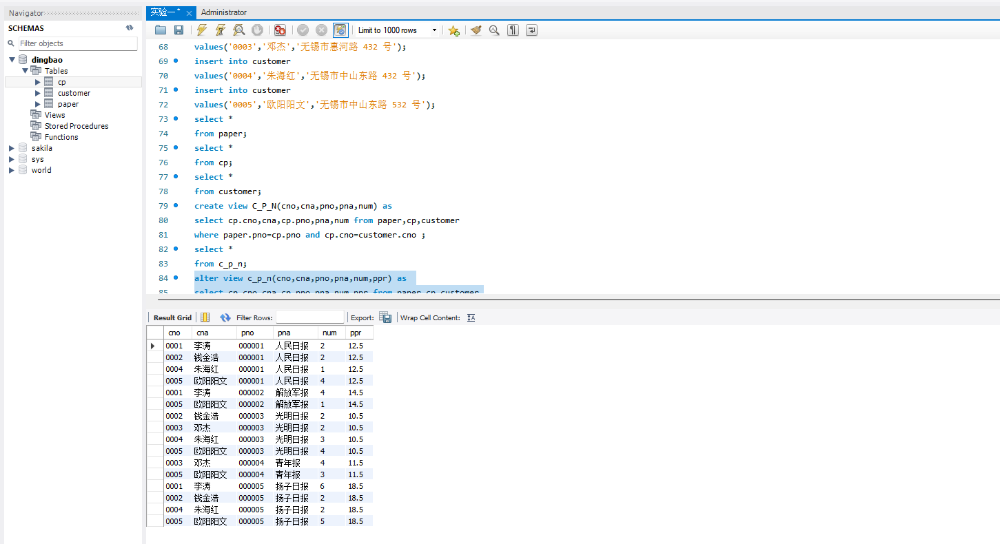
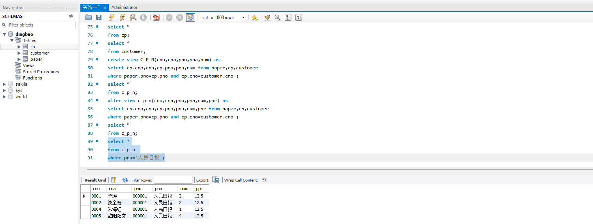
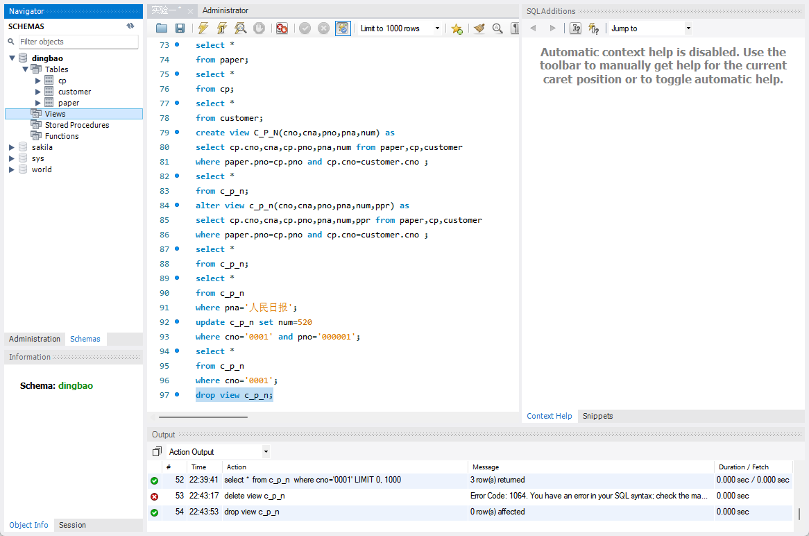

# 《数据库系统实验》

实验报告

| 题目 | 实验三   |
| :--: | -------- |
| 姓名 | 胡舸耀   |
| 学号 | 22336084 |
| 班级 | 行政4班  |

## 一、实验环境：

1.操作系统：win11；

2.DBMS ：mysql 8.0；

## 二、实验内容与完成情况：

### 1.创建数据库以及表

打开mysql，创建数据库 dingbao

```
create database dingbao;
```

运行，刷新scheme后如下：



按照题目要求，创建三个表，键入下列代码，运行得到结果

```
use dingbao;
create table paper
( pno char(6) not null,
 pna varchar(5) not null,
 ppr numeric(3,1) ,
 primary key(pno)
 );
create table cp
( cno char(4) not null,
pno char(6) not null,
 num smallint default 1,
 primary key(pno,cno)
 );
create table customer
( cno char(4) not null,
 cna varchar(4) not null,
 adr varchar(20) not null,
 primary key (cno)
 );
```



按照题目给出数据录入

```
insert into paper
values('000001','人民日报',12.5);
insert into paper
values('000002','解放军报',14.5);
insert into paper
values('000003','光明日报',10.5);
insert into paper
values('000004','青年报',11.5);
insert into paper
values('000005','扬子日报',18.5);
insert into cp
values('0001','000001',2);
insert into cp
values('0001','000002',4);
insert into cp
values('0001','000005',6);
insert into cp
values('0002','000001',2);
insert into cp
values('0002','000003',2);
insert into cp
values('0002','000005',2);
insert into cp
values('0003','000003',2);
insert into cp
values('0003','000004',4);
insert into cp
values('0004','000001',1);
insert into cp
values('0004','000003',3);
insert into cp
values('0004','000005',2);
insert into cp
values('0005','000003',4);
insert into cp
values('0005','000002',1);
insert into cp
values('0005','000004',3);
insert into cp
values('0005','000005',5);
insert into cp
values('0005','000001',4);
insert into customer
values('0001','李涛','无锡市解放东路 123 号');
insert into customer
values('0002','钱金浩','无锡市人民西路 234 号');
insert into customer
values('0003','邓杰','无锡市惠河路 432 号');
insert into customer
values('0004','朱海红','无锡市中山东路 432 号');
insert into customer
values('0005','欧阳阳文','无锡市中山东路 532 号');
```



用select进行验证，分别运行下面三个命令，可以得到题中的表格

```
select * 
from paper;
select * 
from cp;
select * 
from customer;
```







其中cp表是按照cno的顺序递增，只需修改为

```
select * 
from cp order by cno;
```

### 2.创建和使用视图

#### (1)创建视图 C_P_N

```
create view C_P_N(cno, cna, pno, pna, num) as 
select cp.cno, cna, cp.pno, pna, num from paper, cp, customer
where paper.pno=cp.pno and cp.cno=customer.cno ;
select * 
from c_p_n;
```



#### (2)修改已创建的视图C_P_N,使其含报纸单价信息

这里选择对原视图进行修改，直接alter即可

```
alter view c_p_n(cno,cna,pno,pna,num,ppr) as 
select cp.cno,cna,cp.pno,pna,num,ppr from paper,cp,customer
where paper.pno=cp.pno and cp.cno=customer.cno ;
select * 
from c_p_n;
```



#### (3)通过视图C_P_N查询“人民日报”被订阅的情况，并修改查看情况

查询“人民日报”被订阅情况

```
select *
from c_p_n 
where pna='人民日报';
```



修改某人订阅某报的份数对C_P_N进行修改，其中第一行的num确实被修改了，可以通过视图进行修改

```
update c_p_n 
set num=520 
where cno='0001' and pno='000001';;
select * 
from c_p_n 
where cno='0001';
```


### 3.删除视图

视图删除使用drop

```
drop view c_p_n;
```


