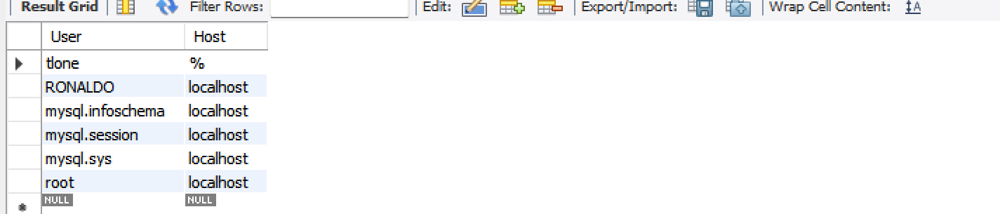
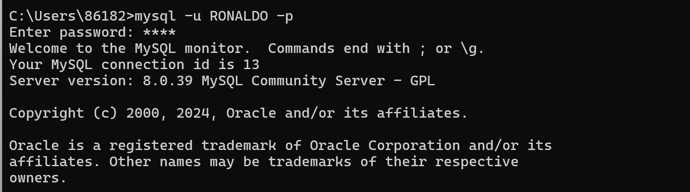
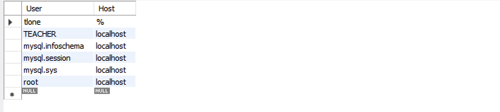
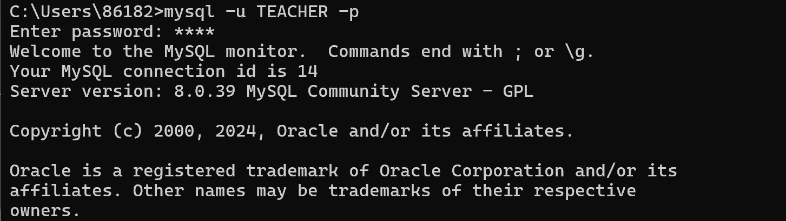
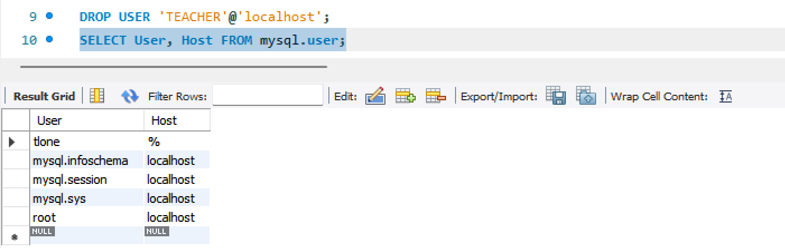
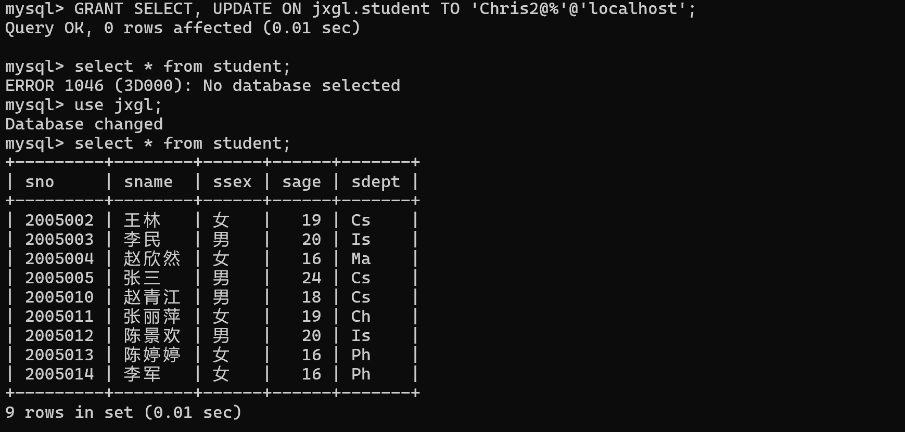
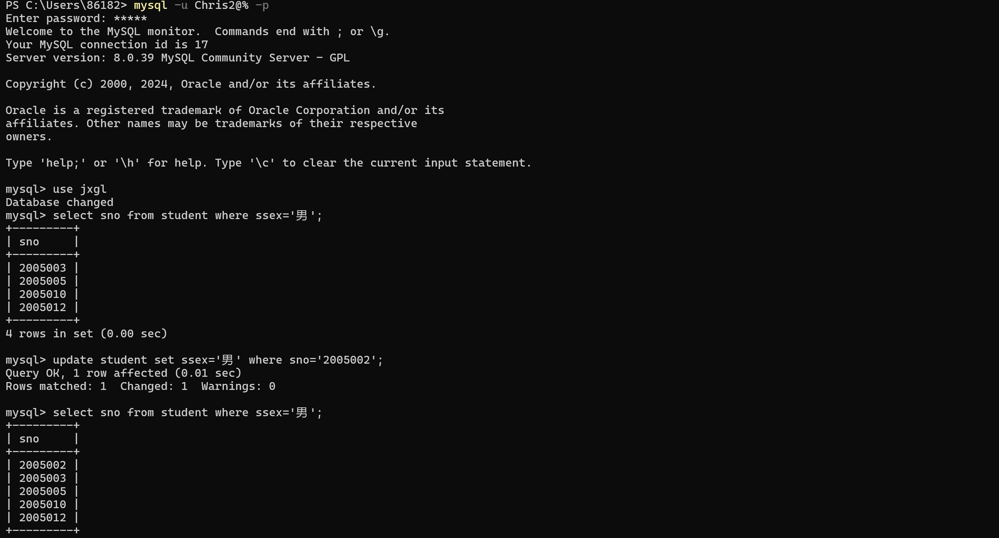
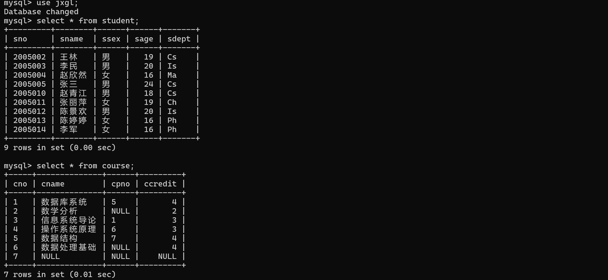
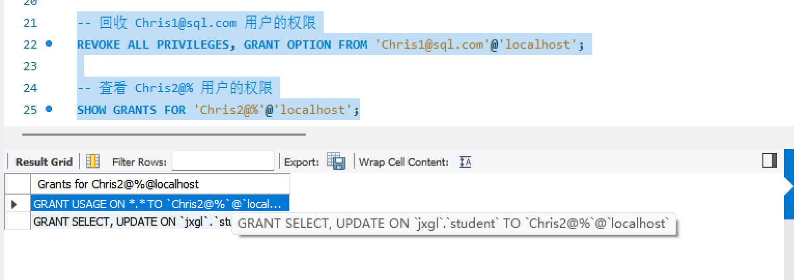

# 数据库系统实验实验报告

| 题目 |  实验十  |
| ---- | :------: |
| 姓名 |  胡舸耀  |
| 学号 | 22336084 |
| 班级 | 行政4班 |

## 一、实验环境

1.操作系统：win11；

2.DBMS ：mysql 8.0；

## 二、实验内容与完成情况：

### 2.1 创建名为 RONALDO, 密码为 NIKE 的用户, 然后显示 MySQL 中 `user` 表的内容

```mysql
CREATE USER 'RONALDO'@'localhost' IDENTIFIED BY 'NIKE';
SELECT User, Host FROM mysql.user;
```



可以看到 `user`中新增了用户 `RONALDO`。在终端中键入 `mysql -u RONALDO -p`再输入密码，可以正确登录



### 2.2 把用户 RONALDO 改名为 TEACHER, 然后显示 MySQL 中 `user` 表的内容

```mysql
RENAME USER 'RONALDO'@'localhost' TO 'TEACHER'@'localhost';
SELECT User, Host FROM mysql.user;
```



可以看到用户 `RONALDO`改名为 `TEACHER`。在终端中键入 `mysql -u TEACHER -p`再输入密码，可以正确登录.



### 2.3 把 TEACHER 的密码改为 hello

```mysql
ALTER USER 'TEACHER'@'localhost' IDENTIFIED BY 'hello';
```

即可将密码修改为hello。登录时要使用新密码。

### 2.4 删除 TEACHER 用户

```mysql
DROP USER 'TEACHER'@'localhost';
SELECT User, Host FROM mysql.user;
```



可以看到用户`TEACHER`已被删除。

### 2.5 新建三个用户，然后显示 MySQL 中 `user` 表的内容

```mysql
CREATE USER 'Chris1@sql.com'@'localhost' IDENTIFIED BY '1234';
CREATE USER 'Chris2@%'@'localhost' IDENTIFIED BY '12345'; 
CREATE USER 'Chris3@%.com'@'localhost' IDENTIFIED BY '123456';
SELECT User, Host FROM mysql.user;
```


### 2.6 授予 `Chris1@sql.com` 用户在 `student` 表上的 `SELECT`、`UPDATE` 权限，并且可以传递给其他用户。然后以 `Chris1@sql.com` 用户登录，将 `student` 表上的 `SELECT`、`UPDATE` 权限授予 `Chris2@%`

```mysql
-- 授予 Chris1@sql.com 用户权限，并允许传递给其他用户
GRANT SELECT, UPDATE ON jxgl.student TO 'Chris1@sql.com'@'localhost' WITH GRANT OPTION;

-- 用 Chris1@sql.com 登录后执行，授予 Chris2@% 权限
GRANT SELECT, UPDATE ON jxgl.student TO 'Chris2@%'@'localhost';
```

在运行第一行代码后，在终端登录 `Chris1@sql.com`，并运行第二行代码，检查本身查询功能是否正确，可以看到可以查询。



退出，登录 `Chris2@%`，检查查询、更新功能，可以看到，均正确运行。先查询为男生的学号，可以看到没有2005002，我们将2005002学生性别改为男，再次查询可以看到。



### 2.7 授予 `Chris3@%.com` 用户在 `jxgl` 数据库中所有表的 `SELECT` 权限

```mysql
GRANT SELECT ON jxgl.* TO 'Chris3@%.com'@'localhost';
```

运行完后，在终端登录 `Chris3@%.com`可以看到可以查询`jxgl`中全部表。



### 2.9 回收 `Chris1@sql.com` 的权限，并查看 `Chris2@%` 的权限

```mysql
-- 回收 Chris1@sql.com 用户的权限
REVOKE ALL PRIVILEGES, GRANT OPTION FROM 'Chris1@sql.com'@'localhost';

-- 查看 Chris2@% 用户的权限
SHOW GRANTS FOR 'Chris2@%'@'localhost';
```

查看结果 `Chris2@%` 用户的权限包括：

* 在 `jxgl.student` 表上的 `SELECT` 和 `UPDATE` 权限。
* `Chris2@%` 用户在所有数据库上“使用”权限（自身自带）。

第一个权限是通过 `Chris1@sql.com` 用户传递的，即使 `Chris1@sql.com` 的权限被回收，`Chris2@%` 仍然保留这些权限。这与我们运行代码后结果一致，MYSQL中权限回收不存在自动级联。


