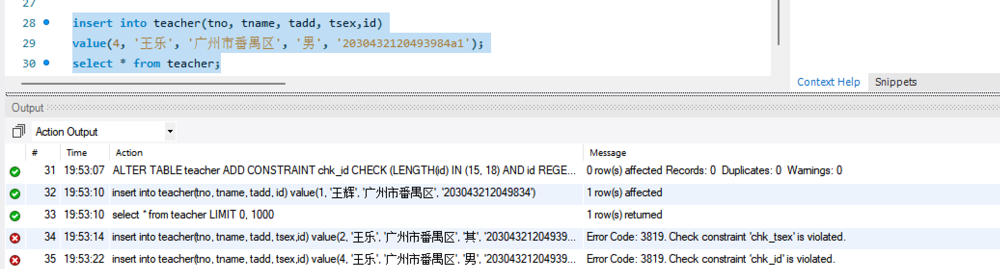

# 数据库系统实验实验报告

| 题目 | 实验十一 |
| ---- | :------: |
| 姓名 |  胡舸耀  |
| 学号 | 22336084 |
| 班级 | 行政4班 |

## 一、实验环境

1.操作系统：win11；

2.DBMS ：mysql 8.0；

## 二、实验内容与完成情况：

### 2.1 创建一个教工表 teacher(tno,tname,tadd,telphone,tsex,id),将教工号tno 设为主键,性别默认值为“男”。① 设置 telphone 默认值为 00000000。②设置 tsex的check 检査约束为:输人值只能为“男”或“女”③设置id的位数为15位或18位,每位都是数字。

```mysql
CREATE TABLE teacher (
    tno INT PRIMARY KEY,         -- 教工号设为主键
    tname VARCHAR(50),  
    tadd VARCHAR(100),   
    telphone VARCHAR(20) DEFAULT '00000000',  -- 电话，默认值为 '00000000'
    tsex CHAR(1) DEFAULT '男',   -- 性别，默认值为 '男'
    id VARCHAR(18)               -- 身份证号，最多18位
);

-- 设置 tsex 性别的检查约束，值只能为 '男' 或 '女'
ALTER TABLE teacher
ADD CONSTRAINT chk_tsex CHECK (tsex IN ('男', '女'));

-- 设置 id 字段的检查约束，确保位数为 15 或 18，且每位都是数字
ALTER TABLE teacher
ADD CONSTRAINT chk_id CHECK (LENGTH(id) IN (15, 18) AND id REGEXP '^[0-9]+$');
```

在创建表时设置主键tno，性别默认值为'男'，telphone默认值为'00000000'。

再添加相关约束设置 tsex的check 检査约束为：输人值只能为“男”或“女”，设置id的位数为15位或18位,每位都是数字。

先对两个默认值进行验证：

```mysql
insert into teacher(tno, tname, tadd, id)
value(1, '王辉', '广州市番禺区', '203043212049834');
select * from teacher;
```


可以看到，默认值成功被赋予。

接下来验证tsex输入只能是男或女和id位数与只能是数字：

```mysql
insert into teacher(tno, tname, tadd, tsex,id)
value(2, '王乐', '广州市番禺区', '其', '203043212049398487');
select * from teacher;

insert into teacher(tno, tname, tadd, tsex,id)
value(4, '王乐', '广州市番禺区', '男', '2030432120493984a1');
select * from teacher;
```




### 2.2 子系统数据库DingBao中的表PAPER完整性规则

表paper创建时如下代码，已有pno的主码约束，pno、pna的非空约束。

```mysql
create table paper
( pno char(6) not null,
 pna varchar(5) not null,
 ppr numeric(3,1) ,
 primary key(pno)
 );
```

对pno，可以约束为只能为6位数字，如下：

```mysql
ALTER TABLE paper
ADD CONSTRAINT chk_pno CHECK (length(pno) in (6) and pno REGEXP '^[0-9]+$');
```

对pna，可以约束报名不能重复，如下：

```mysql
ALTER TABLE paper
ADD CONSTRAINT uq_pna UNIQUE (pna);
```

对ppr，可以约束价格必须大于等于0：

```mysql
ALTER TABLE paper
ADD CONSTRAINT chk_ppr CHECK (ppr >= 0);
```

对ppr，可以约束默认值为0：

```mysql
ALTER TABLE paper
ALTER COLUMN ppr SET DEFAULT 0;
```
