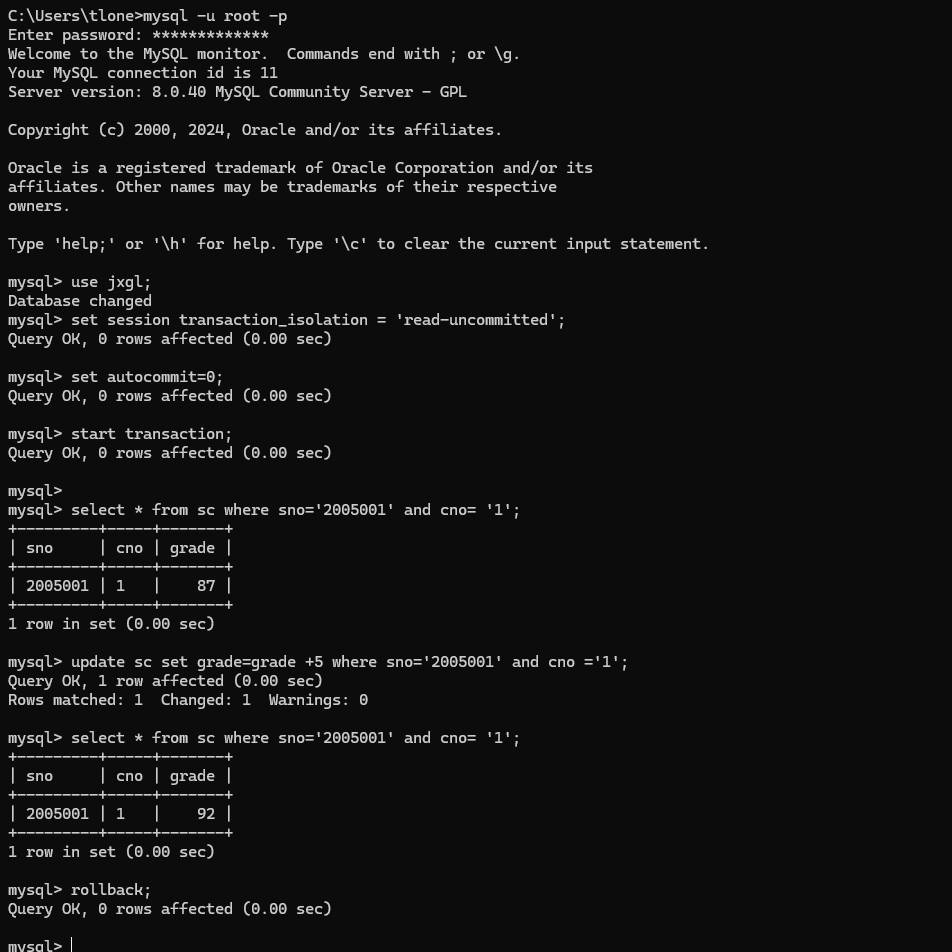
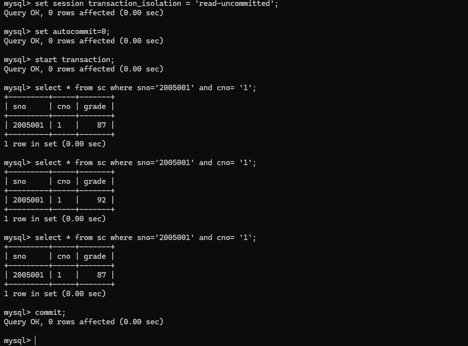
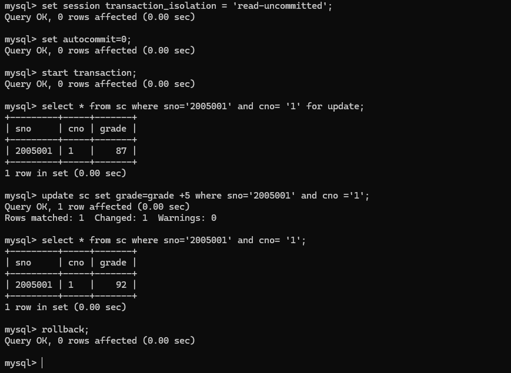
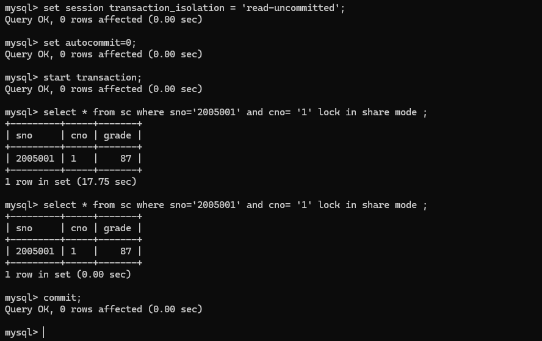

# 数据库系统实验实验报告

| 题目 | 实验十二 |
| ---- | :------: |
| 姓名 |  胡舸耀  |
| 学号 | 22336084 |
| 班级 | 行政4班 |

## 一、实验环境

1.操作系统：win11；

2.DBMS ：mysql 8.0；

## 二、实验内容与完成情况：

### 1、表12-5的实现

session1部分

```sql
use jxgl;

set session transaction_isolation = 'read-uncommitted';

set autocommit=0;

start transaction;

select * from sc where sno='2005001' and cno= '1';

update sc set grade=grade +5 where sno='2005001' and cno ='1';

select * from sc where sno='2005001' and cno= '1';

rollback;
```




根据表中示例，session2的输入顺序，在session1的updata的操作之前进行一次查询，之后进行一次查询，回滚后进行一次查询。

```sql
set session transaction_isolation = 'read-uncommitted';
set autocommit=0;
start transaction;
select * from sc where sno='2005001' and cno= '1';
select * from sc where sno='2005001' and cno= '1';
select * from sc where sno='2005001' and cno= '1';
commit;
```



可以看到结果分别为87、92、87。即产生了脏读现象。

在数据库事务管理中，隔离级别决定了事务之间的数据可见性。在 **READ UNCOMMITTED** 隔离级别下，一个事务（如 `session_2`）可以读取到另一个事务（如 `session_1`）未提交的数据，这种现象称为“脏读”。在上例中， `session_1` 对某个数据进行了修改但未提交事务，而 `session_2` 在此时查询该数据，并读取到了 `session_1` 的未提交更改。此时，`session_2` 读取的数据称为脏数据，可能与最终提交的数据不一致。

如果 `session_1` 后来执行了回滚（ROLLBACK），它对数据的所有未提交更改将被撤销，数据恢复到回滚前的状态。例如，表中的数据将恢复到原始值 87。但对于已经读取到未提交数据的 `session_2` 来说，回滚并不会自动撤销它之前查询到的脏数据。因为事务隔离级别是基于事务提交与否进行控制的，而非查询结果的最终一致性，所以 `session_2` 在回滚后仍然保持先前的查询结果，直到它自己发起新的查询。

### 2、表12-6的实现

在两个终端上进行，第一个终端进行section1，第二个进行section2。

首先在session1上：

```sql
set session transaction_isolation = 'read-uncommitted';
set autocommit=0;
start transaction;
select * from sc where sno='2005001' and cno= '1' for update;
```

加上排他锁；

然后在session2上：

```sql
set session transaction_isolation = 'read-uncommitted';
set autocommit=0;
start transaction;
select * from sc where sno='2005001' and cno= '1' lock in share mode ;
```

加上共享锁，这时候使用共享锁时，其他事务可以读取这些行，但不能修改它们。多个事务可以对相同的行加共享锁，但是任何一个事务都无法对这些行进行写操作，直到共享锁被释放。但因为session1先用了排他锁加锁，这时session2等待锁释放。

接下来在session1上进行数据更新以及查询：

```sql
update sc set grade=grade +5 where sno='2005001' and cno ='1';
select * from sc where sno='2005001' and cno= '1';
rollback;
```

这时如果你操作时间过长会导致session2上产生超时报错：`ERROR 1205 (HY000): Lock wait timeout exceeded; try restarting transaction`

在session1上操作完成回滚后，session1的锁释放，session2获得锁，运行得到结果，因为session2在session1更新数据时没有获得锁，所以不会读取此时的数据，不产生脏读现象。

具体结果如下：





全部上述例子展示了 **READ UNCOMMITTED** 隔离级别的特点，即虽然回滚会恢复数据一致性，但已读取的脏数据仍然对已经执行的查询有效，直到执行新的查询。这种行为可能导致数据的不一致性，因此在需要更高一致性时，应选择更高的隔离级别（如 **REPEATABLE READ** 或  **SERIALIZABLE** ）或者添加锁以避免脏读问题。
