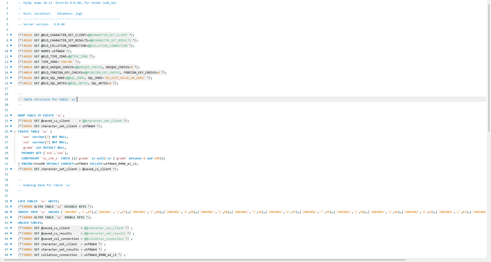

# 数据库系统实验实验报告

| 题目 | 实验十三 |
| ---- | :------: |
| 姓名 |  胡舸耀  |
| 学号 | 22336084 |
| 班级 | 行政4班 |

## 一、实验环境

1.操作系统：win11；

2.DBMS ：mysql 8.0；

## 二、实验内容与完成情况：

### 1、对表 `sc`、`course` 和 `student` 分别做表备份和表恢复

在这里，我们选择在命令行条件下的备份与恢复，使用 `mysqldump` 工具

```bash
# 备份表 sc
mysqldump -u root -p jxgl sc >  desktop/sc_backup.sql

# 备份表 course
mysqldump -u root -p jxgl course >  desktop/course_backup.sql

# 备份表 student
mysqldump -u root -p jxgl student >  desktop/student_backup.sql
```

在>后写出要保存的文件路径，这里我选择的是保存到用户桌面上。


可以在桌面上找到三个sql文件后缀的备份文件。在workbench中打开检查文件是否正确保存，这里我选择打开 sc_backup.sql 作为示例，可以看到确实正确保存了表的内容。




接下来进行文件恢复，这里我们选择在命令行使用 `mysql -u root -p 数据库名<表备份文件所在的路径`指令进行操作。

```bash
# 恢复表 sc
mysql -u root -p jxgl < desktop/sc_backup.sql

# 恢复表 course
mysql -u root -p jxgl < desktop/course_backup.sql

# 恢复表 student
mysql -u root -p jxgl < desktop/student_backup.sql
```

这里需要先进入到文件所在的文件夹或者添加相对路径，输入相应指令即可。


### 2、对教学管理系统进行不同方法的完整备份和恢复

这里我们可以选择使用 `mysqldump`，SQL语句，workbench三种情况。

#### （1） `mysqldump`

```bash
# 完整备份数据库 jxg1
mysqldump -u root -p jxgl > jxgl_backup.sql

# 恢复完整备份
mysql -u root -p jxgl < jxgl_backup.sql
```

命令行操作很简单，和1中操作相同，把表部分删去，系统会自动保存整个数据库。


#### (2) SQL语句

SQL语句只能备份表，想要备份整个数据库，我们需要将每个表备份（类似内容1）

```sql
SELECT * INTO OUTFILE '/backup/student.csv'
FIELDS TERMINATED BY ',' 
ENCLOSED BY '"'
LINES TERMINATED BY '\n'
FROM student;

SELECT * INTO OUTFILE '/backup/course.csv'
FIELDS TERMINATED BY ',' 
ENCLOSED BY '"'
LINES TERMINATED BY '\n'
FROM course;

SELECT * INTO OUTFILE '/backup/sc.csv'
FIELDS TERMINATED BY ',' 
ENCLOSED BY '"'
LINES TERMINATED BY '\n'
FROM sc;

-- 对其他表执行相同操作备份

LOAD DATA INFILE '/backup/student.csv'
INTO TABLE student
FIELDS TERMINATED BY ',' 
ENCLOSED BY '"'
LINES TERMINATED BY '\n';

LOAD DATA INFILE '/backup/course.csv'
INTO TABLE course
FIELDS TERMINATED BY ',' 
ENCLOSED BY '"'
LINES TERMINATED BY '\n';

LOAD DATA INFILE '/backup/sc.csv'
INTO TABLE sc
FIELDS TERMINATED BY ',' 
ENCLOSED BY '"'
LINES TERMINATED BY '\n';

-- 对其他表执行相同操作恢复
```

#### (3) workbench

找到  `Server / Data Export`:


选择jxgl数据库，勾选数据库前方框（如果想要单独备份单个或多个表只需要点击数据库在二级目录下选择需要的表即可）。

在这里选择数据和结构的存储，我们这里选择两者。勾选Objects to Export下三个选项，备份存储过程、函数、事件和触发器。可以选择单独表存储或者全部存储到一个sql文件中，我们选择后者。修改你想要的文件路径，输出，可以在你设定的路径中找到输出的sql文件。


还原同样可以在server中找到data import，打开界面，选择Import from Self-Contained File和目标数据库进行还原。具体数据如下：


### 3、对教学管理系统与2011年6月29日上午9:00:00进行了差异备份;上午9:40数据库发生故障,根据其差异备份和日志文件进行位置恢复

位置恢复是通过 `binlog` 根据特定的日志文件位置进行恢复，而不是依赖时间戳。

检查二进制日志是否打开，可以看到已经开启


在my.ini文件找可以找到对应配置：


完整备份如下，同时创建新的日志文件，刷新MySQL数据库，可以看到日志文件多了一个。：


添加修改操作。在修改年龄时，第二步错误修改全部数据的sage为0。我们要保留第一步和第三步的操作


查看简码日志利用at位置点恢复

原日志乱码，我们保存日志文件并转化成64位简码。在简码日志中最后可以找到我们之前的操作。依靠具体时间以及操作，找到我们需要恢复的位置前后.


进行差异恢复：可以看到，我们即保存了错误发生前的操作，将2005001学号的学生年龄设为18，也保留了错误发生后将学号为2005002的学生年龄设为23的操作。


