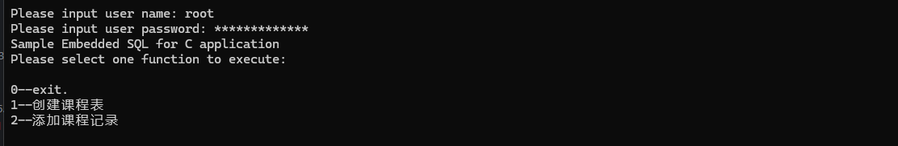
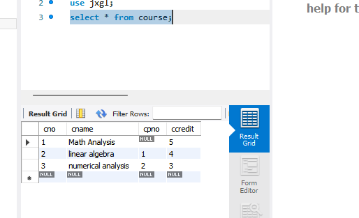
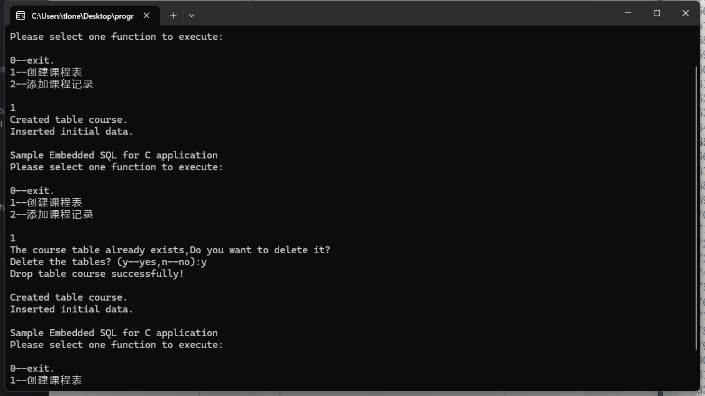
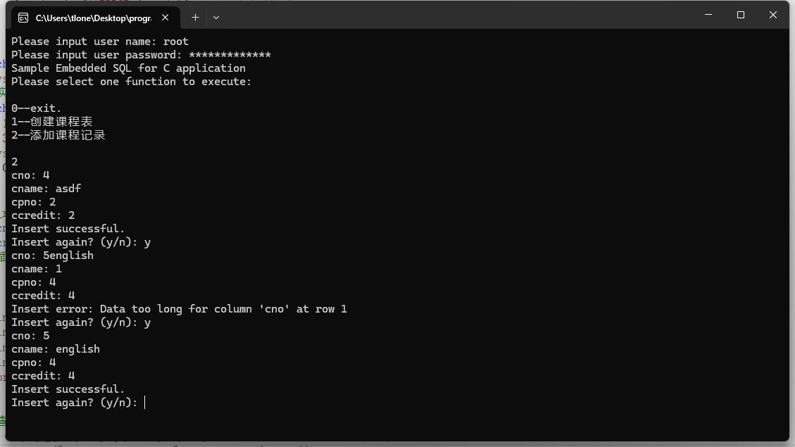

# 数据库系统实验实验报告

| 题目 |  实验四  |
| ---- | :------: |
| 姓名 |  胡舸耀  |
| 学号 | 22336084 |
| 班级 | 行政4班 |

## 一、实验环境

1.操作系统：win11；

2.DBMS ：mysql 8.0；

## 二、实验内容与完成情况：

### 2.1 数据库的连接

参考实验书配置好VC++.NET环境后，进行初始数据库连接，参考给出实验模板，连接上自己的数据库

```c
#include <mysql.h>
#include <stdio.h>
#include <stdlib.h>
#include <winsock.h>
#include <conio.h>
#pragma warning(disable:4996)

MYSQL mysql; // 全局 MySQL 变量
MYSQL_RES* result;
//实现的功能
int create_course_table();
int insert_rows_into_course_table();

int main() {
    char fu[2], username[50], password[50];
    int i = 0;

    mysql_init(&mysql);

    // 输入用户名，允许输入错误
    printf("Please input user name: ");
    while (1) {
        char ch = getch();
        if (ch == '\r') break;
        else if (ch == '\b' && i > 0) { i--; printf("\b \b"); }
        else if (i < sizeof(username) - 1) { username[i++] = ch; printf("%c",ch); }
    }
    username[i] = '\0';
    i = 0;
    //输入密码并加密
    printf("\nPlease input user password: ");
    while (1) {
        char ch = getch();
        if (ch == '\r') break;
        else if (ch == '\b' && i > 0) { i--; printf("\b \b"); }
        else if (i < sizeof(password) - 1) { password[i++] = ch; printf("*"); }
    }
    password[i] = '\0';
    //连接数据库
    if (mysql_real_connect(&mysql, "localhost", username, password, "jxgl", 3306, 0, 0)) {
        while(1) {
            printf("\nSample Embedded SQL for C application\n");
            printf("Please select one function to execute:\n\n");
            printf("0--exit.\n");
            printf("1--创建课程表\n");
            printf("2--添加课程记录\n");
            printf("\n");
            fu[0] = '0';
            scanf("%s", &fu);
            if (fu[0] == '0')exit(0);
            else  if (fu[0] == '1')create_course_table();
            else  if (fu[0] == '2')insert_rows_into_course_table();
            else  printf("Please reenter\n");
        }
    }

    mysql_close(&mysql);
    if (result) mysql_free_result(result);
    return 0;
}
```

其中实现了username和password输入，并且允许删除后重输。



成功连接数据库如上图所示。

### 2.2 实现create_course_table()创建Course表

```c
int create_course_table() {
    //选择course表
    result = mysql_list_tables(&mysql, "course");
    //若存在，选择是否删除
    if (mysql_num_rows(result) > 0) {
        mysql_free_result(result);
        printf("The course table already exists,Do you want to delete it?\n");
        printf("Delete the tables? (y--yes,n--no):");
        // 清理输入缓冲区
        while ((getchar()) != '\n');
        if (getchar() == 'y' || getchar() == 'Y') {
            if (!mysql_query(&mysql, "drop table course;")) {
                printf("Drop table course successfully!\n\n");
            }
            else { printf("ERROR:drop table course\n\n"); }
        }
    }

    const char* create_query = "CREATE TABLE course (cno CHAR(1) PRIMARY KEY, cname CHAR(100), cpno CHAR(1), ccredit INT) ENGINE=InnoDB;";
    if (!mysql_query(&mysql, create_query)) printf("Created table course.\n");
    //插入实例数据
    const char* insert_data = "INSERT INTO course (cno, cname, cpno, ccredit) VALUES "
        "('1', 'Math Analysis', null, 5), ('2', 'linear algebra', '1', 4), "
        "('3', 'numerical analysis', '2', 3);";
    if (!mysql_query(&mysql, insert_data)) printf("Inserted initial data.\n");
    return 0;
}
```

运行后在MYSQL中查询可以看到



创建表并插入成功，如果重复插入的话可以正确删除并且重建



### 2.3 实现insert_rows_into_course_table()添加Course表的记录

```c
int insert_rows_into_course_table() {
    char icno[10], icname[30], icpno[10], strquery[256];
    int iccredit;
    //进行插入，并进行初始化查询
    do {
      
         
        printf("cno: "); scanf("%s", icno);
        printf("cname: "); scanf("%s", icname);
        printf("cpno: "); scanf("%s", icpno);
        printf("ccredit: "); scanf("%d", &iccredit);
        snprintf(strquery, sizeof(strquery),
            "INSERT INTO course(cno, cname, cpno, ccredit) VALUES ('%s', '%s', '%s', %d)",
            icno, icname, icpno, iccredit);
        //查询
        if (!mysql_query(&mysql, strquery)) printf("Insert successful.\n");
        else printf("Insert error: %s\n", mysql_error(&mysql));
        //询问是否再次查询
        printf("Insert again? (y/n): ");
        // 清理输入缓冲区
        while ((getchar()) != '\n');
    } while (getchar() == 'y');

    return 0;
}
```

运行结果如下：




### 2.4 源代码

```c
#include <mysql.h>
#include <stdio.h>
#include <stdlib.h>
#include <winsock.h>
#include <conio.h>
#pragma warning(disable:4996)

MYSQL mysql; // 全局 MySQL 变量
MYSQL_RES* result;
//实现的功能
int create_course_table();
int insert_rows_into_course_table();

int main() {
    char fu[2], username[50], password[50];
    int i = 0;

    mysql_init(&mysql);

    // 输入用户名，允许输入错误
    printf("Please input user name: ");
    while (1) {
        char ch = getch();
        if (ch == '\r') break;
        else if (ch == '\b' && i > 0) { i--; printf("\b \b"); }
        else if (i < sizeof(username) - 1) { username[i++] = ch; printf("%c",ch); }
    }
    username[i] = '\0';
    i = 0;
    //输入密码并加密
    printf("\nPlease input user password: ");
    while (1) {
        char ch = getch();
        if (ch == '\r') break;
        else if (ch == '\b' && i > 0) { i--; printf("\b \b"); }
        else if (i < sizeof(password) - 1) { password[i++] = ch; printf("*"); }
    }
    password[i] = '\0';
    //连接数据库
    if (mysql_real_connect(&mysql, "localhost", username, password, "jxgl", 3306, 0, 0)) {
        while(1) {
            printf("\nSample Embedded SQL for C application\n");
            printf("Please select one function to execute:\n\n");
            printf("0--exit.\n");
            printf("1--创建课程表\n");
            printf("2--添加课程记录\n");
            printf("\n");
            fu[0] = '0';
            scanf("%s", &fu);
            if (fu[0] == '0')exit(0);
            else  if (fu[0] == '1')create_course_table();
            else  if (fu[0] == '2')insert_rows_into_course_table();
            else  printf("Please reenter\n");
        }
    }

    mysql_close(&mysql);
    if (result) mysql_free_result(result);
    return 0;
}

int create_course_table() {
    //选择course表
    result = mysql_list_tables(&mysql, "course");
    //若存在，选择是否删除
    if (mysql_num_rows(result) > 0) {
        mysql_free_result(result);
        printf("The course table already exists,Do you want to delete it?\n");
        printf("Delete the tables? (y--yes,n--no):");
        // 清理输入缓冲区
        while ((getchar()) != '\n');
        if (getchar() == 'y' || getchar() == 'Y') {
            if (!mysql_query(&mysql, "drop table course;")) {
                printf("Drop table course successfully!\n\n");
            }
            else { printf("ERROR:drop table course\n\n"); }
        }
    }

    const char* create_query = "CREATE TABLE course (cno CHAR(1) PRIMARY KEY, cname CHAR(100), cpno CHAR(1), ccredit INT) ENGINE=InnoDB;";
    if (!mysql_query(&mysql, create_query)) printf("Created table course.\n");
    //插入实例数据
    const char* insert_data = "INSERT INTO course (cno, cname, cpno, ccredit) VALUES "
        "('1', 'Math Analysis', null, 5), ('2', 'linear algebra', '1', 4), "
        "('3', 'numerical analysis', '2', 3);";
    if (!mysql_query(&mysql, insert_data)) printf("Inserted initial data.\n");
    return 0;
}

int insert_rows_into_course_table() {
    char icno[10], icname[30], icpno[10], strquery[256];
    int iccredit;
    //进行插入，并进行初始化查询
    do {
      
         
        printf("cno: "); scanf("%s", icno);
        printf("cname: "); scanf("%s", icname);
        printf("cpno: "); scanf("%s", icpno);
        printf("ccredit: "); scanf("%d", &iccredit);
        snprintf(strquery, sizeof(strquery),
            "INSERT INTO course(cno, cname, cpno, ccredit) VALUES ('%s', '%s', '%s', %d)",
            icno, icname, icpno, iccredit);
        //查询
        if (!mysql_query(&mysql, strquery)) printf("Insert successful.\n");
        else printf("Insert error: %s\n", mysql_error(&mysql));
        //询问是否再次查询
        printf("Insert again? (y/n): ");
        // 清理输入缓冲区
        while ((getchar()) != '\n');
    } while (getchar() == 'y');

    return 0;
}
```
