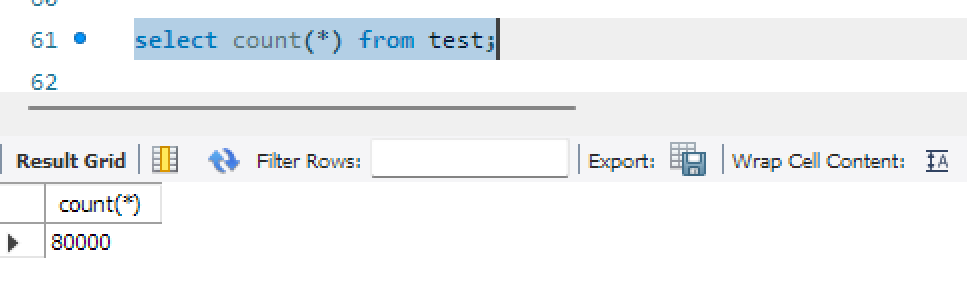
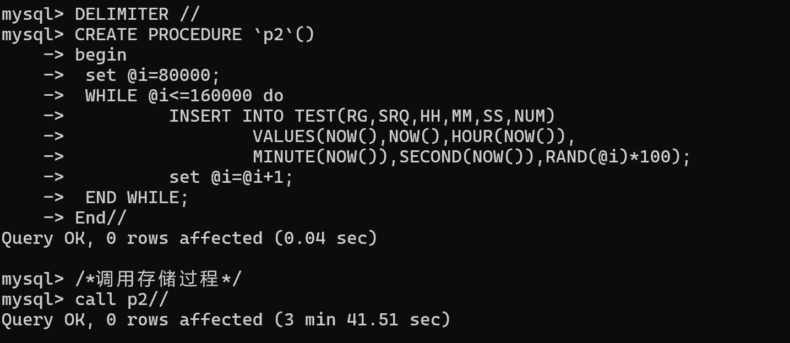
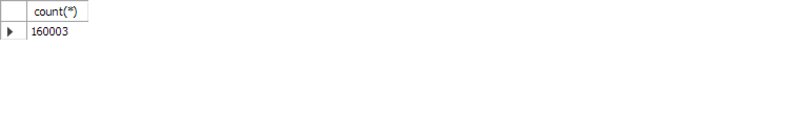

# 数据库系统实验实验报告

| 题目 |  实验七  |
| ---- | :------: |
| 姓名 |  胡舸耀  |
| 学号 | 22336084 |
| 班级 | 行政4班 |

## 一、实验环境

1.操作系统：win11；

2.DBMS ：mysql 8.0；

## 二、实验内容与完成情况：

### 2.1 test表的创建以及初始8万条数据的插入

在jxgl数据库中2新建表test并且插入数据：

```sql
Create table test(id int unique AUTO_INCREMENT,rg datetime null,srq varchar(20) null,hh smallint null, mm smallint null, ss smallint null,num numeric(12,3),primary key(id)) AUTO_INCREMENT = 1 engine = MyISAM;
/*创建存储过程生成表中数据*/
DELIMITER //
CREATE PROCEDURE `p1`()
begin
	set @i=1;
	WHILE @i<=80000 do
		INSERT INTO TEST(RG,SRQ,HH,MM,SS,NUM)
			VALUES(NOW(),NOW(),HOUR(NOW()),
			MINUTE(NOW()),SECOND(NOW()),RAND(@i)*100);
		set @i=@i+1;
	END WHILE;
End//
```

上面我建立了一个存储过程p1，存入80000条数据，在workbench中使用时，当超过30秒后数据连接会自动断开，导致无法完全插入。这里可以选择一次插入10000条，多次插入（设置八个存储过程，逐一插入）。或者选择在命令指示符中进入mysql，连接到你的用户运行，总时间约为3分半钟。


可以看到成功调用存储过程。这里我们调用select检查插入数据数目，可以看到的确为80000条。



### 2.2 在不使用索引各个操作的时间

#### 2.2.1 单记录插入

```sql
DELIMITER //
Select @i:=max(id) from test;  
INSERT INTO TEST(RG,SRQ,HH,MM,SS,NUM)
        VALUES(NOW(),NOW(),HOUR(NOW()),
MINUTE(NOW()),SECOND(NOW()),RAND(@i)*100);//
```


用时0s。

#### 2.2.2 查询所有记录，按id排序

```sql
Select * from test order by id;
```


用时0.453s。

#### 2.2.3 查询所有记录，按mm排序

```sql
Select * from test order by mm;
```


用时0.438s。

#### 2.2.4 单纪录查询

```sql
Select id from test where id=51
```


用时约为0s。接下来我们进行加入索引后的操作。

### 2.3 使用mm字段建立非聚集索引各个操作的时间

#### 2.3.0 加入索引

```sql
Create index indexname1 on test(mm);
```


#### 2.3.1 单记录插入

```sql
DELIMITER //
Select @i:=max(id) from test;  
INSERT INTO TEST(RG,SRQ,HH,MM,SS,NUM)
        VALUES(NOW(),NOW(),HOUR(NOW()),
MINUTE(NOW()),SECOND(NOW()),RAND(@i)*100);//
```


用时约为0s。

#### 2.3.2 查询所有记录，按id排序

```sql
Select * from test order by id;
```


用时0.344s。

#### 2.3.3 查询所有记录，按mm排序

```sql
Select * from test order by mm;
```


用时0.422s。

#### 2.3.4 单纪录查询

```sql
Select id from test where id=51
```


用时约为0s。

### 2.4 插入更多数据，再次重复2.2、2.3过程

我们建立存储过程p2

```sql
DELIMITER //
CREATE PROCEDURE `p2`()
begin
	set @i=80000;
	WHILE @i<=160000 do
		INSERT INTO TEST(RG,SRQ,HH,MM,SS,NUM)
			VALUES(NOW(),NOW(),HOUR(NOW()),
			MINUTE(NOW()),SECOND(NOW()),RAND(@i)*100);
		set @i=@i+1;
	END WHILE;
End//
/*调用存储过程*/
call p2//
DELIMITER ;
```



可以看到成功调用存储过程。这里我们调用select检查插入数据数目，可以看到的确为160003条。160001条是存储过程调用（p2插入了80001条），我们在之前单记录插入2条。



这里我们同样进行是否使用索引的对比。

### 2.4.1 在不使用索引各个操作的时间

#### 2.4.1.0 删除索引

```sql
drop index indexname1 on test;
```


#### 2.4.1.1 单记录插入

```sql
DELIMITER //
Select @i:=max(id) from test;  
INSERT INTO TEST(RG,SRQ,HH,MM,SS,NUM)
        VALUES(NOW(),NOW(),HOUR(NOW()),
MINUTE(NOW()),SECOND(NOW()),RAND(@i)*100);//
```


用时0s。

#### 2.4.1.2 查询所有记录，按id排序

```sql
Select * from test order by id;
```


用时0.875s。

#### 2.4.1.3 查询所有记录，按mm排序

```sql
Select * from test order by mm;
```


用时0.937s。

#### 2.4.1.4 单纪录查询

```sql
Select id from test where id=51
```


用时约为0s。接下来我们进行加入索引后的操作。

### 2.4.2 使用mm字段建立非聚集索引各个操作的时间

#### 2.4.2.0 加入索引

```sql
Create index indexname1 on test(mm);
```


#### 2.4.2.1 单记录插入

```sql
DELIMITER //
Select @i:=max(id) from test;  
INSERT INTO TEST(RG,SRQ,HH,MM,SS,NUM)
        VALUES(NOW(),NOW(),HOUR(NOW()),
MINUTE(NOW()),SECOND(NOW()),RAND(@i)*100);//
```


用时约为0s。

#### 2.4.2.2 查询所有记录，按id排序

```sql
Select * from test order by id;
```


用时0.609s。

#### 2.4.2.3 查询所有记录，按mm排序

```sql
Select * from test order by mm;
```


用时约为0.906s。

#### 2.4.2.4 单纪录查询

```sql
Select id from test where id=51
```


用时约为0s。

## 三、实验结果

| 数据量 | 操作                   | 是否加入索引 | 所用时间/s |
| ------ | ---------------------- | ------------ | ---------- |
| 80000  | 单记录插入             | 否           | 0          |
| 80001  | 查询所有记录，按id排序 | 否           | 0.453      |
| 80001  | 查询所有记录，按mm排序 | 否           | 0.438      |
| 80001  | 单纪录查询             | 否           | 0          |
| 80001  | 单记录插入             | 是           | 0          |
| 80002  | 查询所有记录，按id排序 | 是           | 0.344      |
| 80002  | 查询所有记录，按mm排序 | 是           | 0.422      |
| 80002  | 单纪录查询             | 是           | 0          |
| 160003 | 单记录插入             | 否           | 0          |
| 160004 | 查询所有记录，按id排序 | 否           | 0.875      |
| 160004 | 查询所有记录，按mm排序 | 否           | 0.937      |
| 160004 | 单纪录查询             | 否           | 0          |
| 160004 | 单记录插入             | 是           | 0          |
| 160005 | 查询所有记录，按id排序 | 是           | 0.609      |
| 160005 | 查询所有记录，按mm排序 | 是           | 0.906      |
| 160005 | 单纪录查询             | 是           | 0          |

1. **单记录插入（是否加入索引的影响）：**
   1. 无论是否对 `mm` 字段建立非聚集索引，单记录插入的耗时始终为 `0`。这可能是因为插入的数量较少，且数据库系统对插入操作进行了优化。
   2. 对于大规模数据插入操作时，索引可能会显著增加插入时间，因为索引需要在插入时同步更新。
2. **查询所有记录，按 `id` 或 `mm` 排序：**
   * **未加索引** ：
   * 查询耗时较长。例如，数据量为 160,004 时：
     * 按 `id` 排序查询耗时为 `0.875` 秒。
     * 按 `mm` 排序查询耗时更高，为 `0.937` 秒。
     * 这表明在未加索引的情况下，数据库需要全表扫描（Full Table Scan）并进行排序，因此查询时间较长。
   * **加索引** ：
   * 加入非聚集索引后，按 `id` 排序的查询耗时从 `0.875` 秒下降至 `0.609` 秒；按 `mm` 排序的查询耗时从 `0.937` 秒下降至 `0.906` 秒。
   * 虽然查询效率有所提高，但仍需注意按 `id` 排序和按 `mm` 排序的耗时差别，这表明索引的优化效果主要体现在按 `mm` 排序的场景中（因为索引是基于 `mm` 字段的）。还有一部分是因为创建数据时，mm已经按照顺序排序且大部分相同（数据mm为创建时的分钟）。
3. **单记录查询（是否加入索引的影响）：**
   * 对于单记录查询，耗时均为 `0`，这表明：
     * 数据量在测试条件下较小，未超过数据库系统的缓存优化能力。
     * 索引的存在对单条记录查询的影响可能不明显，因为数据库系统可以直接定位目标记录。
