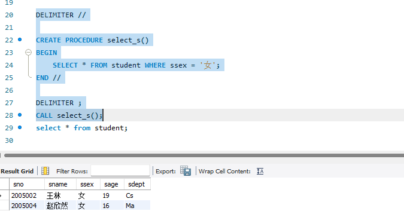
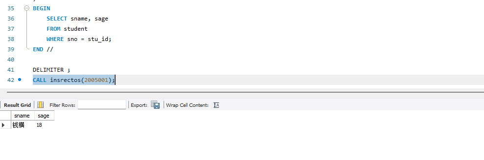
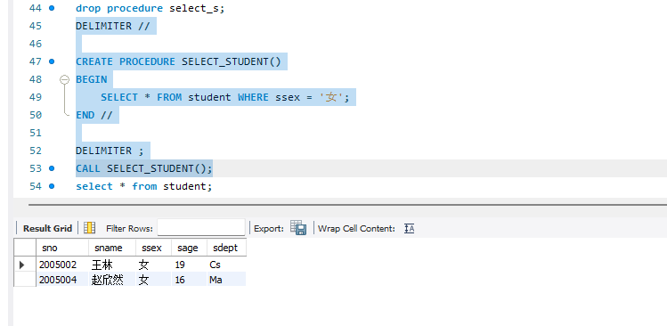

# 数据库系统实验实验报告

| 题目 |  实验八  |
| ---- | :------: |
| 姓名 |  胡舸耀  |
| 学号 | 22336084 |
| 班级 | 行政4班 |

## 一、实验环境

1.操作系统：win11；

2.DBMS ：mysql 8.0；

## 二、实验内容与完成情况：

### 2.1 创建一个名称为select_s的存储过程,该存储过程的功能是从 student 表中查询所有女生的信息,并执行该存储过程

定义了一个名为 `select_s` 的存储过程，功能是查询 `student` 表中性别为女的同学。

```sql
DELIMITER //

CREATE PROCEDURE select_s()
BEGIN
    SELECT * FROM student WHERE ssex = '女';
END //

DELIMITER ;

CALL select_s();
```



### 2.2 定义具有参数的存储过程。创建名称为insrectos的存储过程,该存储过程的功能是从student表中根据学号查询某一学生的姓名和年龄并返回。执行该存储过程

```sql
DELIMITER //

CREATE PROCEDURE insrectos(
    IN stu_id INT
)
BEGIN
    SELECT sname, sage 
    FROM student 
    WHERE sno = stu_id;
END //

DELIMITER ;
CALL insrectos(2005001);
```



### 2.3 将存储过程select_s改名为SELECT_STUDENT

MySQL 不支持直接重命名存储过程，删除后重建或者利用导出存储过程定义，修改定义并重新创建新存储过程实现。这里展示删除后重建。

```sql
drop procedure select_s;
DELIMITER //

CREATE PROCEDURE SELECT_STUDENT()
BEGIN
    SELECT * FROM student WHERE ssex = '女';
END //

DELIMITER ;
CALL SELECT_STUDENT();
```


