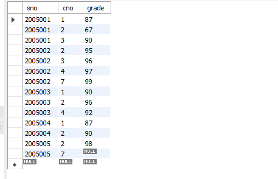
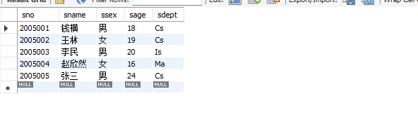
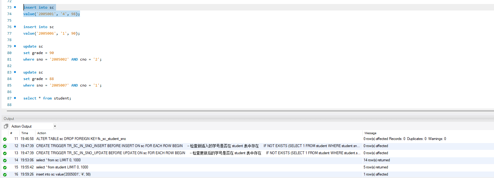
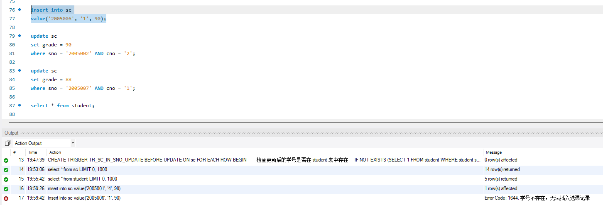
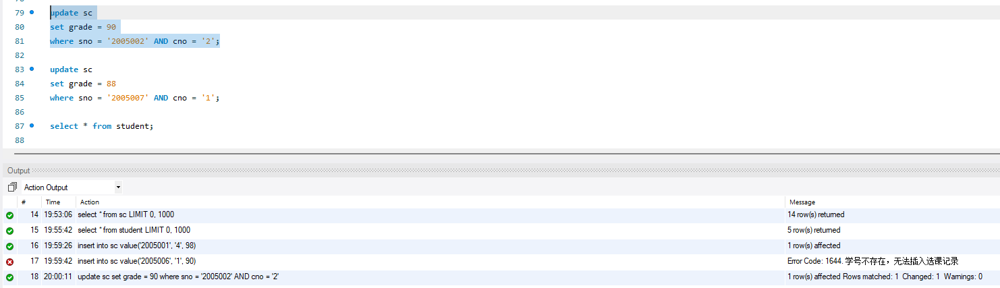
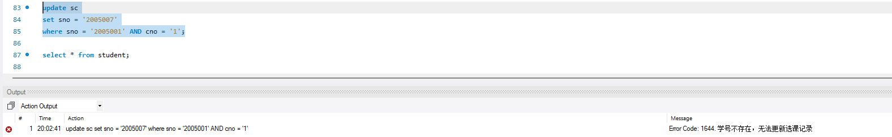
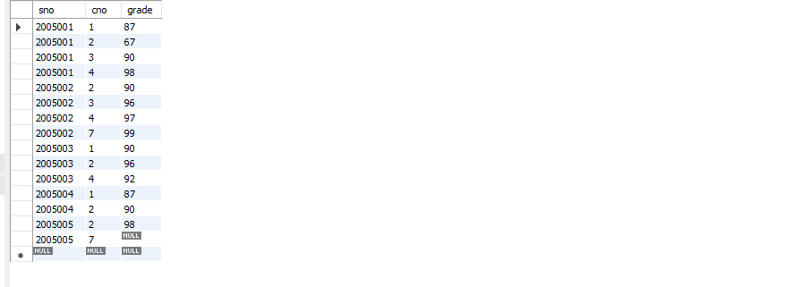

# 数据库系统实验实验报告

| 题目 |  实验九  |
| ---- | :------: |
| 姓名 |  胡舸耀  |
| 学号 | 22336084 |
| 班级 | 行政4班 |

## 一、实验环境

1.操作系统：win11；

2.DBMS ：mysql 8.0；

## 二、实验内容与完成情况：

## 2.1 在sc表中创建insert、update触发器TR_SC_IN_SNO，要求插入选课记录或修改选课表学生学号时，检查该学号是否为student表中的学号，若无则不许插入选课记录或修改选课表学生学号

首先移除 `sc`对 `student`的外码约束，因为我们在之前创建`sc`表时没有给外键命名，这里我们删除`sc`后重建如下：

```mysql
create table sc (
sno VARCHAR(7) NOT NULL,
cno VARCHAR(7) NOT NULL,
grade int NULL check (grade is NULL or( grade between 0 and 100)),
PRIMARY KEY(sno, cno),
constraint fk_sc_student_sno Foreign Key(sno) references student(sno));
```

插入数据后，再将外码约束删除

```mysql
ALTER TABLE sc DROP FOREIGN KEY fk_sc_student_sno;
```

在`sc`表中创建`insert`、`update`触发器`TR_SC_IN_SNO`

```mysql
DELIMITER //

CREATE TRIGGER TR_SC_IN_SNO_INSERT
BEFORE INSERT ON sc
FOR EACH ROW
BEGIN
    -- 检查新插入的学号是否在 student 表中存在
    IF NOT EXISTS (SELECT 1 FROM student WHERE student.sno = NEW.sno) THEN
        SIGNAL SQLSTATE '45000' SET MESSAGE_TEXT = '学号不存在，无法插入选课记录';
    END IF;
END//

DELIMITER ;

DELIMITER //

CREATE TRIGGER TR_SC_IN_SNO_UPDATE
BEFORE UPDATE ON sc
FOR EACH ROW
BEGIN
    -- 检查更新后的学号是否在 student 表中存在
    IF NOT EXISTS (SELECT 1 FROM student WHERE student.sno = NEW.sno) THEN
        SIGNAL SQLSTATE '45000' SET MESSAGE_TEXT = '学号不存在，无法更新选课记录';
    END IF;
END//

DELIMITER ;
```

### 2.2 在sc表中录入或修改实验数据，查看触发器的执行情况

原`sc`表中初始数据如下：



`student`表初始数据如下：



尝试如下：

```mysql
insert into sc
value('2005001', '4', 98);

insert into sc
value('2005006', '1', 90);

update sc
set grade = 90
where sno = '2005002' AND cno = '2';

update sc
set sno = '2005007'
where sno = '2005001' AND cno = '1';
```

四个插入和更新操作的结果分别如下：









操作后`sc`如下：



可以看到正确操作均进行，错误操作均中止。
