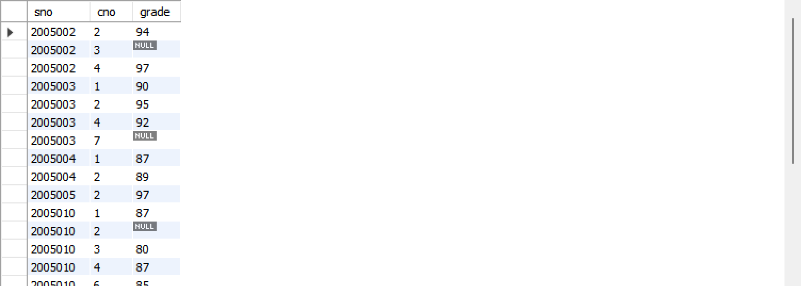

# 数据库系统实验实验报告

| 题目 |  实验五  |
| ---- | :------: |
| 姓名 |  胡舸耀  |
| 学号 | 22336084 |
| 班级 | 行政4班 |

## 一、实验环境

1.操作系统：win11；

2.DBMS ：mysql 8.0；

## 二、实验内容与完成情况：

### （1）在jxgl中录入表和数据

参考之前实验，创建jxgl数据库以及对应表，插入数据(实验四2.0部分)

```sql
create database jxgl;
show databases;
use jxgl;
# create database

create table student (
sno VARCHAR(7) NOT NULL,
sname VARCHAR(16),
ssex CHAR(2) DEFAULT '男' CHECK (ssex='男' or ssex='女'),
sage int,
sdept VARCHAR(2),
PRIMARY KEY(sno));

create table course (
cno VARCHAR(2) NOT NULL,
cname VARCHAR(20),
cpno VARCHAR(2) NULL,
ccredit int,
PRIMARY KEY(cno));

create table sc (
sno VARCHAR(7) NOT NULL,
cno VARCHAR(7) NOT NULL,
grade int NULL check (grade is NULL or( grade between 0 and 100)),
PRIMARY KEY(sno, cno),
Foreign Key(sno) references student(sno),
Foreign Key(cno) references course(cno));
#create tables

insert into student(sno,sname,ssex,sage,sdept)
values
('2005001','钱横','男',18,'Cs'), 
('2005002','王林','女',19,'Cs'), 
('2005003','李民','男',20,'Is'), 
('2005004','赵欣然','女',16,'Ma'), 
('2005005','张三','男',24,'Cs');

insert into course(cno,cname,cpno,ccredit)
values
('1','数据库系统','5',4),
('2','数学分析',null,2), 
('3','信息系统导论','1',3), 
('4','操作系统原理','6',3),
('5','数据结构','7',4), 
('6','数据处理基础',null,4);

insert into sc(sno,cno,grade)
values
('2005001','1',87), 
('2005001','2',67), 
('2005001','3',90), 
('2005002','2',95), 
('2005002','3',96), 
('2005002','4',97), 
('2005003','1',90),
('2005003','2',96), 
('2005003','4',92),
('2005004','1',87),
('2005004','2',90),   
('2005005','2',98);

```

之后，将书中给出的数据插入。

```sql
insert into student
values
('2005010','赵青江','男',18,'Cs'),
('2005011','张丽萍','女',19,'Ch'),
('2005012','陈景欢','男',20,'Is'),
('2005013','陈婷婷','女',16,'Ph'),
('2005014','李军','女',16,'Ph');

insert into sc 
values
('2005010','1',87),
('2005010','2',null),
('2005010','3',80),
('2005010','4',87),
('2005010','6',85),
('2005011','1',52),
('2005011','2',47),
('2005011','3',53),
('2005011','5',45),
('2005012','1',84),
('2005012','3',null),
('2005012','4',67),
('2005012','5',81);
```

### （2）使用SQL进行更新操作

#### 2.1 给IS系的学生开设7号课程，建立相应的选课记录，成绩为空

```sql
insert into course
values
(7,null,null,null);

insert into sc(sno, cno)
select sno, 7
from student
where sdept='Is';

select *
from sc;
```


#### 2.2 在表student中检索每门课均不及格的学生学号、姓名、年龄、性别及所在系信息,并把检索到的信息存入新表ts中

```sql
create table ts(
sno VARCHAR(7) NOT NULL,
sname VARCHAR(16),
sage int,
sdept VARCHAR(2),
PRIMARY KEY(sno));

insert into ts
select sno, sname, sage, sdept
from student natural join sc
group by sno
having max(grade)<60;

select *
from ts;
```


#### 2.3 将学号为2005001的学生姓名改为"刘华"，年龄增加1岁

```sql
update student
set sname='刘华', sage=sage+1
where sno='2005001';

select *
from student;
```


#### 2.4 把选修了“数据库系统”课程而成绩不及格的学生的成绩全部改为空值

```sql
update course natural join sc
set grade=null
where cname='数据库系统' and grade<60;

select *
from sc;
```


#### 2.5 学生王林在3号课程考试作弊，该课成绩改为空值

```sql
update student natural join sc
set grade=null
where cno=3 and sname='王林'；

select *
from student natural join sc;
```


可以看到王林三号课程成绩变成了空值

#### 2.6 把成绩低于总平均成绩的女同学成绩提高5%

```sql
SET SQL_SAFE_UPDATES = 0;
with avggrade(ggrade) as(
    select avg(grade) from sc)
update sc natural join student natural join avggrade
set grade=1.05*grade
where ssex='女' and grade<ggrade;

select *
from sc natural join student;
```


#### 2.7 在基本表sc中修改课程号为“2”号课程的成绩,成绩小于等于80分时降低2%，成绩大于80分时降低1%(用两个update语实现)

```sql
update sc
set grade=0.98*grade
where cno=2 and grade<=80;

update sc
set grade=0.99*grade
where cno=2 and grade>80;

select *
from sc
where cno=2;
```


#### 2.8 把“钱横”的选课记录全部删去

在 2.3 中我们把钱横的名字改成了刘华，这里先把他的名字改回来再删除课程记录

```sql
update student 
set sname = '钱横' 
where sno='2005001';

delete 
from sc
where sno=(
    select sno 
    from student
    where sname='钱横');

select *
from sc;
```



#### 2.9 能删除2005001的学生记录吗

可以，在2.8基础上，再删去student中2005001的学生即可（在2.8中，将sc中相应学号的学生记录已经全部删去了）

```sql
delete 
from student 
where sno='2005001';

select * 
from student;
```


