# 数据库系统实验实验报告

| 题目 |  实验四  |
| ---- | :------: |
| 姓名 |  胡舸耀  |
| 学号 | 22336084 |
| 班级 | 行政4班 |

## 一、实验环境

1.操作系统：win11；

2.DBMS ：mysql 8.0；

## 二、实验内容与完成情况：

### 2.0 准备

按照实验三，创建jxgl数据库包，含表student、course、sc。

```sql
create database jxgl;
show databases;
use jxgl;

create table student (
sno VARCHAR(7) NOT NULL,
sname VARCHAR(16),
ssex CHAR(2) DEFAULT '男' CHECK (ssex='男' or ssex='女'),
sage int,
sdept VARCHAR(2),
PRIMARY KEY(sno));

create table course (
cno VARCHAR(2) NOT NULL,
cname VARCHAR(20),
cpno VARCHAR(2) NULL,
ccredit int,
PRIMARY KEY(cno));

create table sc (
sno VARCHAR(7) NOT NULL,
cno VARCHAR(7) NOT NULL,
grade int NULL check (grade is NULL or( grade between 0 and 100)),
PRIMARY KEY(sno, cno),
Foreign Key(sno) references student(sno),
Foreign Key(cno) references course(cno));
```

插入数据

```sql
insert into student(sno,sname,ssex,sage,sdept)
values
('2005001','钱横','男',18,'Cs'), 
('2005002','王林','女',19,'Cs'), 
('2005003','李民','男',20,'Is'), 
('2005004','赵欣然','女',16,'Ma'), 
('2005005','张三','男',24,'Cs');

insert into course(cno,cname,cpno,ccredit)
values
('1','数据库系统','5',4),
('2','数学分析',null,2), 
('3','信息系统导论','1',3), 
('4','操作系统原理','6',3),
('5','数据结构','7',4), 
('6','数据处理基础',null,4), 
('7','C 语言','6',3);

insert into sc(sno,cno,grade)
values
('2005001','1',87), 
('2005001','2',67), 
('2005001','3',90), 
('2005002','2',95), 
('2005002','3',96), 
('2005002','4',97), 
('2005002','7',99), 
('2005003','1',90),
('2005003','2',96), 
('2005003','4',92),
('2005004','1',87),
('2005004','2',90),   
('2005005','2',98), 
('2005005','7',null);
```

### 2.1 基于 jxgl 数据库，使用 SQL 语句表达以下查询

#### 2.1.1 检索年龄大于 23 岁的男学生的学号和姓名

```sql
select sno, sname
from stduent
where sage>23 and ssex = '男';
```

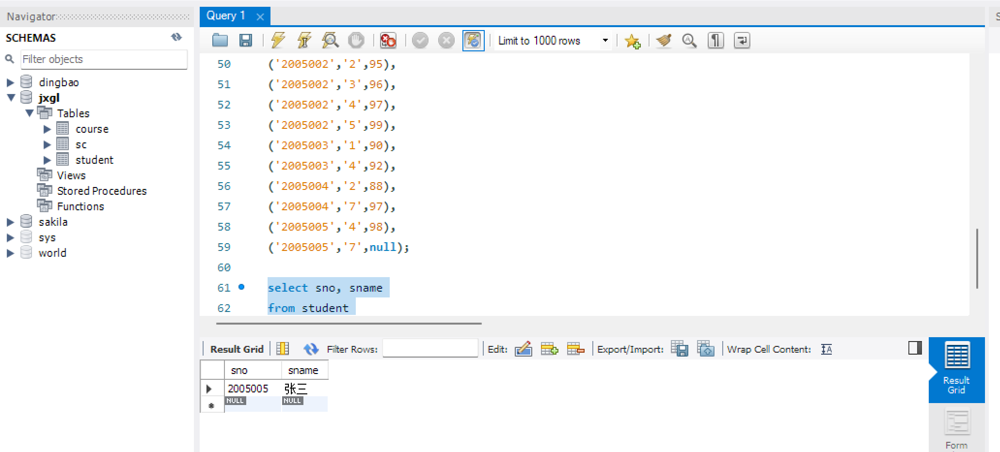

#### 2.1.2 检索至少选修一门课程的女学生姓名

```sql
select distinct sname
from student natural join sc
where ssex='女';
```

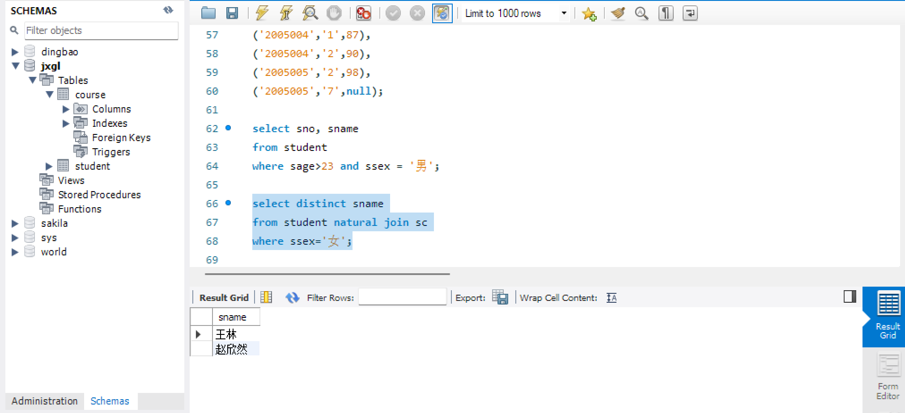

#### 2.1.3 检索王林不学的课程的课程号

```sql
select cno
from course
where cno not in(
    select cno
    from student natural join sc
    where sname='王林');
```

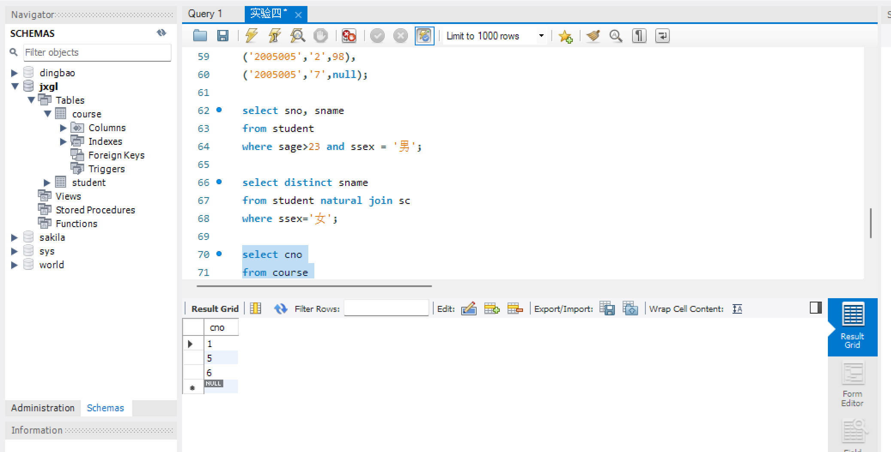

#### 2.1.4 检索至少选修两门课程的学生学号

```sql
select sno
from sc
group by sno
having count(*)>=2;
```

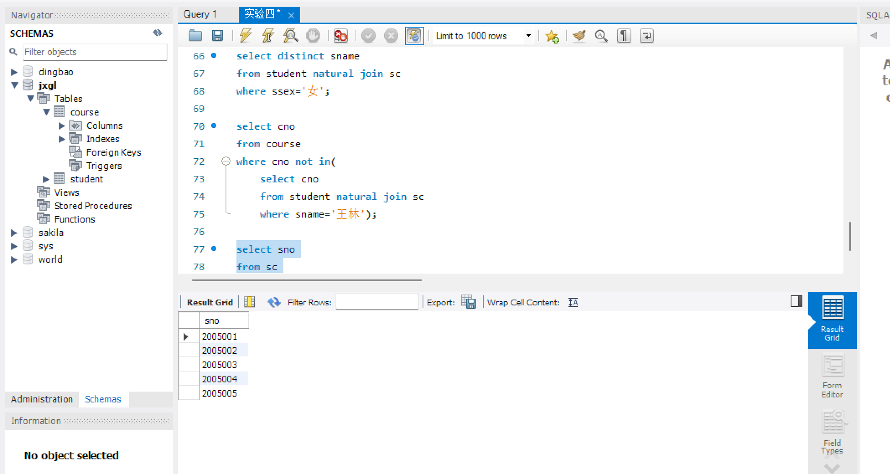

#### 2.1.5 检索全部学生都选修的课程的课程号和课程名

```sql
select cno, cname
from course natural join sc
group by cno
having count(*)=(
    select count(*)
    from student);
```

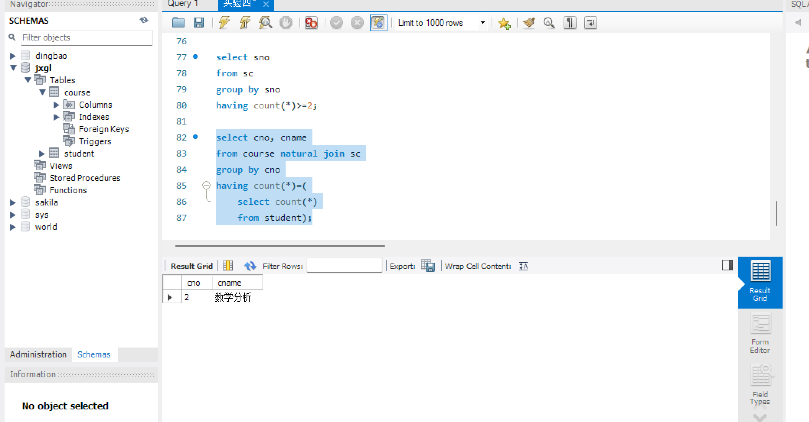

#### 2.1.6 检索选修了所有 3 学分课程的学生平均成绩

```sql
select avg(grade)
from course natural join sc
where ccredit=3
group by sno
having count(*)=(
    select count(*)
    from course
    where ccredit=3);
```

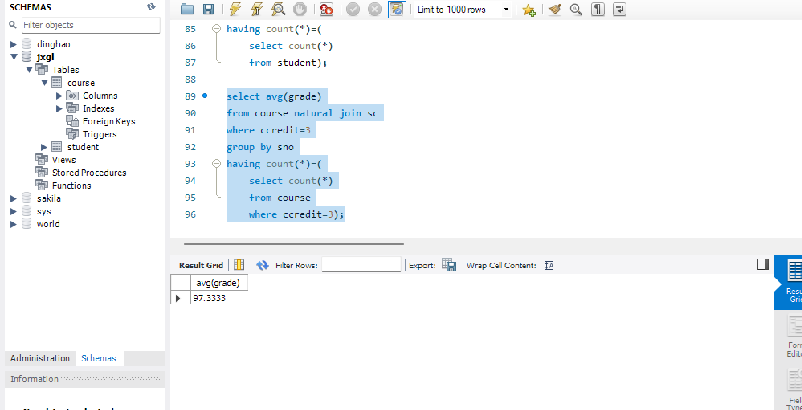

### 2.2 基于 jxgl 数据库，使用 SQL 语句表达一下查询

#### 2.2.1 统计有学生选修的课程门数

```sql
select count(distinct cno)
from sc;
```

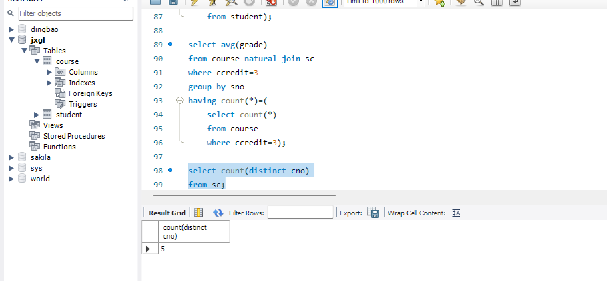

#### 2.2.2 求选修 4 号课程的学生的平均年龄

```sql
select avg(sage)
from student natural join sc
where cno=4;
```

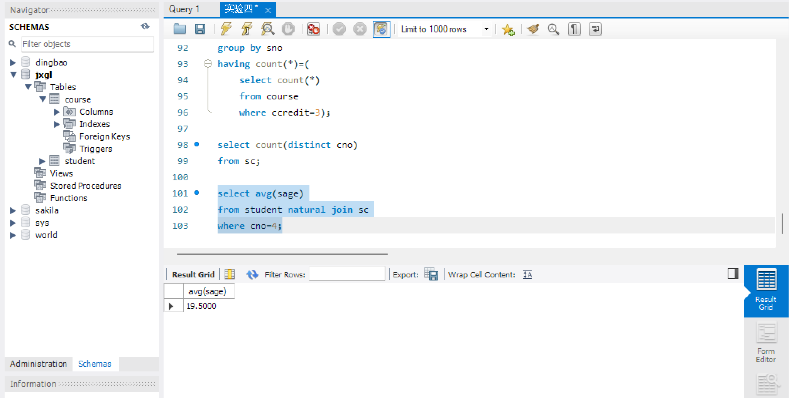

#### 2.2.3 求学分为 3 的每门课程的学生平均成绩

```sql
select cname, avg(grade)
from course natural join sc
where ccredit=3
group by cno;
```

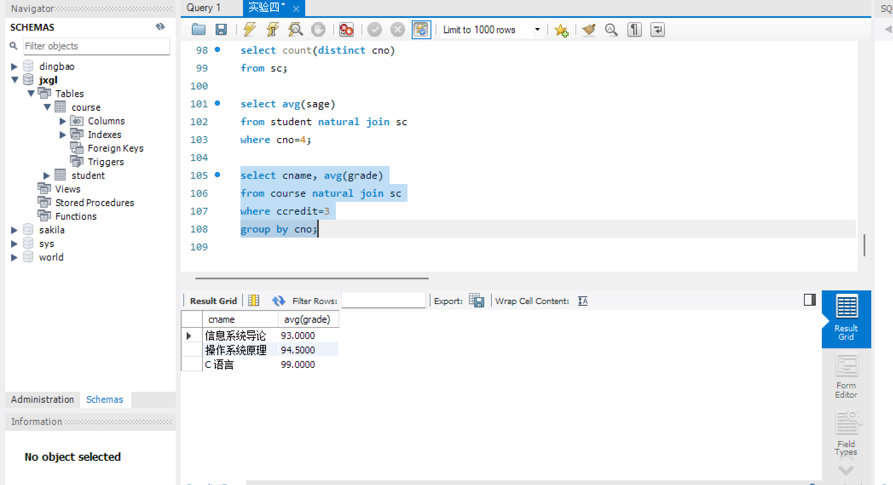

#### 2.2.4 统计每门课程的学生选修人数，要求超过 3 人的课程才统计，要求输出课程号和选修人数，查询结果按人数降序排列，若人数相同，按课程号升序排列

```sql
select cno,count(*) as stucount
from sc
group by cno
having count(*)>3
order by stucount desc, cno asc;
```

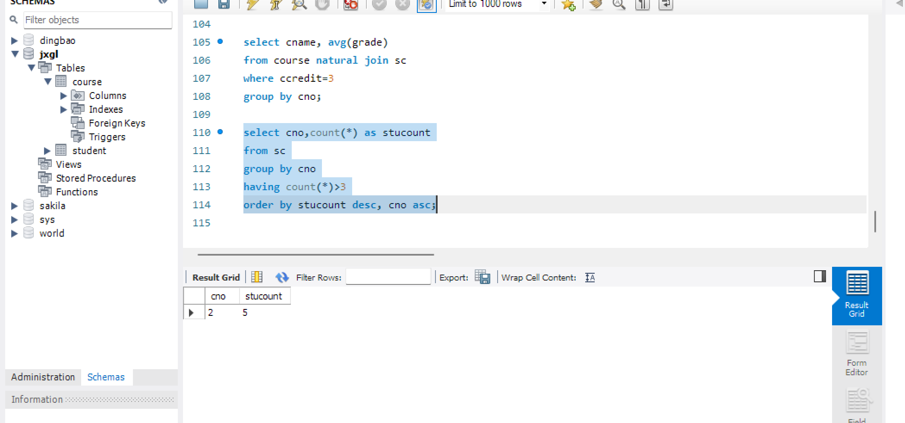

#### 2.2.5 检索学号比"王林"同学大而年龄比她小的学生姓名

```sql
select t.sname
from student as s, student as t
where s.sname='王林' and s.sno<t.sno and s.sage>t.sage;
```

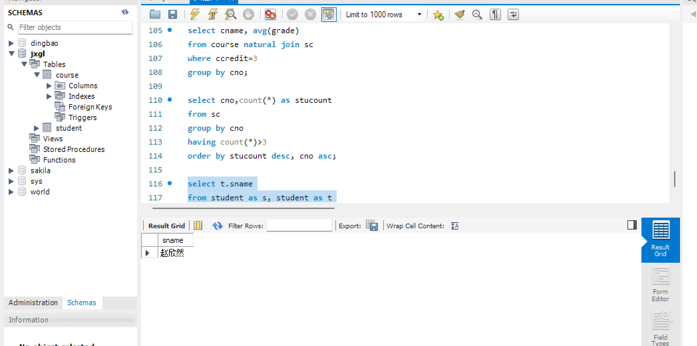

#### 2.2.6 检索姓名以"王"开头的所有学生的姓名和年龄

```sql
select sname,sage
from student
where sname like "王%";
```

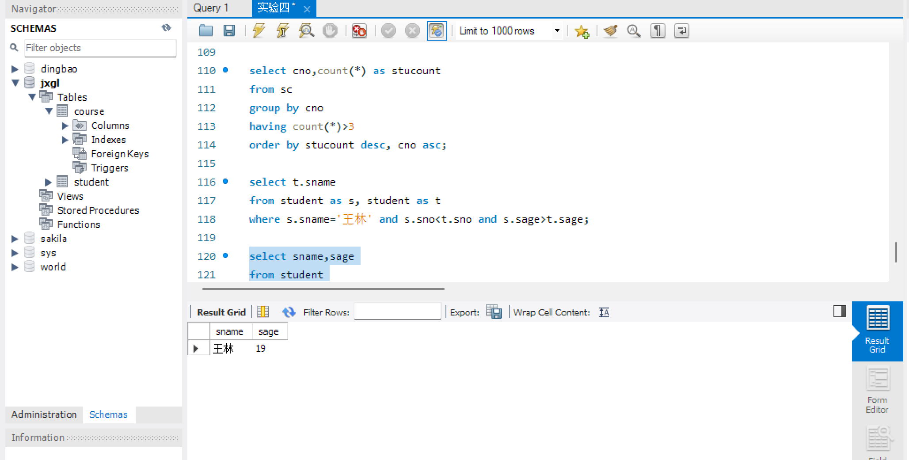

#### 2.2.7 在 sc 表中检索成绩为空值的学生的学号和课程号

```sql
select sno, cno
from sc
where grade is null;
```

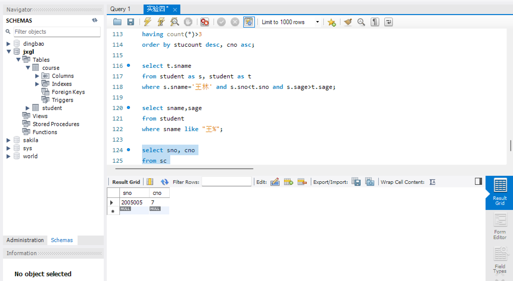

#### 2.2.8 求年龄大于女学生平均年龄的男学生的姓名和年龄

```sql
select sname, sage
from student
where ssex='男' and sage>(
    select avg(sage)
    from student
    where ssex='女');
```

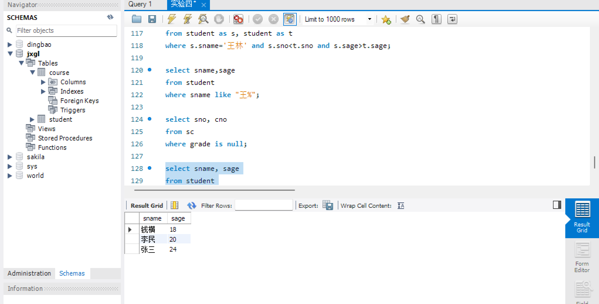

#### 2.2.9 求年龄大于所有女学生年龄的男学生的姓名和年龄

```sql
select sname, sage
from student
where ssex='男' and sage>(
    select max(sage)
    from student
    where ssex='女');
```

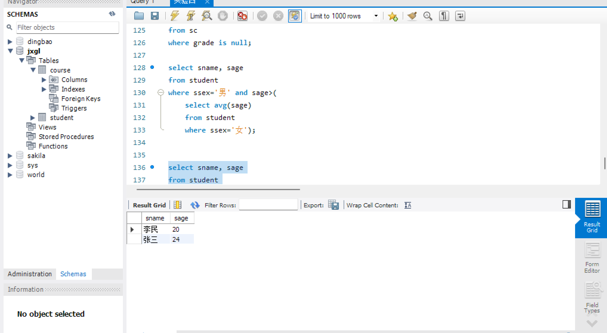

#### 2.2.10 检索选修 4 门以上课程的学生总成绩(不统计不及格课程)，并要求按总成绩的降序排列出来

```sql
select sno, sum(grade)
from sc
where grade>60
group by sno
having count(*)>=4
order by sum(grade) desc;
```

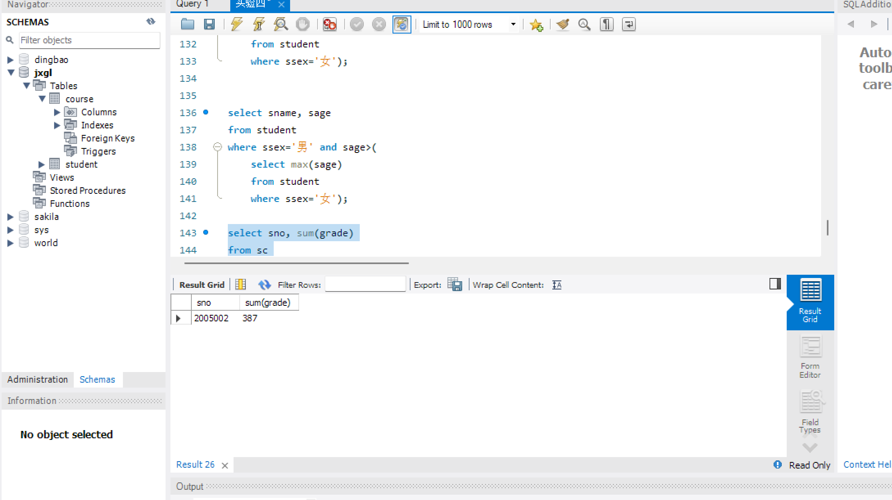
